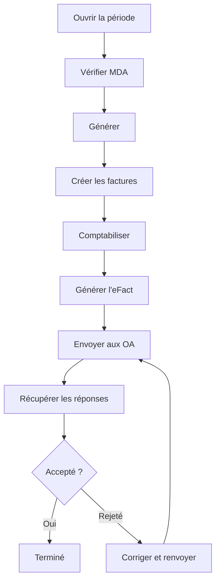

# Facturer un mois, pas à pas

Ce guide vous accompagne **du début à la fin** d'un mois de facturation : ouvrir la
période, vérifier l'assurabilité, générer les factures, les comptabiliser, puis
**envoyer la part mutuelle par eFact** et suivre les réponses. Suivez-le en gardant
Resthome ouvert à côté : chaque étape indique **où cliquer**.

!!! tip "L'idée en deux parties"
    Chaque mois se facture en **deux flux** :

    - la **part résident** (chambre + suppléments) → factures classiques ;
    - la **part mutuelle** (forfait INAMI) → envoi **eFact** aux organismes
      assureurs.

    Resthome les mène en parallèle sur une même **période**.

## Étape 1 — Ouvrir la période du mois

1. Menu principal → application **MR/MRS**.
2. **Facturation → Périodes de facturation**.
3. Ouvrez la période du mois, ou créez-la avec **Nouvelle période**.

La période liste les résidents concernés et son **état** en haut (brouillon →
générée → facturée → clôturée).

## Étape 2 — Vérifier l'assurabilité (MDA)

Avant de facturer la mutuelle, contrôlez que chacun est **en ordre** :

1. Sur la période, cliquez **Vérifier MDA** (contrôle par lot).
2. Attendez les réponses ; corrigez les cas signalés (mutuelle erronée, perte
   d'assurabilité).

C'est l'étape qui évite les rejets plus tard. Détails : [Assurabilité
(MDA)](../ehealth/mda.md).

## Étape 3 — Générer les lignes de facturation

1. Cliquez **Générer**.
2. Resthome calcule pour chaque résident : **hébergement**, **forfait** (selon la
   catégorie Katz et les jours de présence), **suppléments**, et applique les
   **absences**.

!!! note "Anticipative"
    L'hébergement est facturé **un mois d'avance** ; le forfait et les suppléments
    sur le mois presté. Voir [Vue d'ensemble](index.md).

## Étape 4 — Créer les factures (part résident)

1. Cliquez **Créer les factures**.
2. Les factures **brouillon** de la part résident sont générées.
3. Vérifiez-les, puis **Comptabilisez**-les.

!!! warning "Une facture comptabilisée « fige » le mois"
    Une fois **comptabilisée**, la facture d'un résident est verrouillée pour ce
    mois (protection). Pour la corriger : remettez-la en **brouillon** ou faites
    une **note de crédit**, puis **Actualisez**. Les autres résidents ne sont pas
    touchés.

## Étape 5 — Générer l'eFact (part mutuelle)

Une fois les factures comptabilisées :

1. Sur la période, cliquez **Générer l'eFact**.
2. Resthome constitue les **lots** eFact, **regroupés par union** d'organismes
   assureurs.

## Étape 6 — Envoyer aux organismes assureurs

1. Ouvrez **eHealth → eFact → Cockpit** (ou les lots).
2. Cliquez **Tout envoyer** (ou envoyez lot par lot).
3. Les envois partent vers les mutuelles via le réseau eHealth.

## Étape 7 — Suivre les réponses

1. Cliquez **Récupérer les réponses** pour rapatrier les accusés et décomptes.
2. Chaque lot passe **Envoyé → Accusé reçu → Accepté / Rejeté**.
3. En cas de **rejet**, corrigez la cause (assurabilité, dates, montants) et
   **renvoyez**.

Détails et boutons avancés : [Facturation électronique (eFact)](../ehealth/efact.md).

## Récapitulatif du parcours

## Pour aller plus loin

- [Assurabilité (MDA)](../ehealth/mda.md)
- [Facturation électronique (eFact)](../ehealth/efact.md)
- [Absences et hospitalisations](absences.md)
- [Accords (eAgreement)](../ehealth/eagreement.md)
