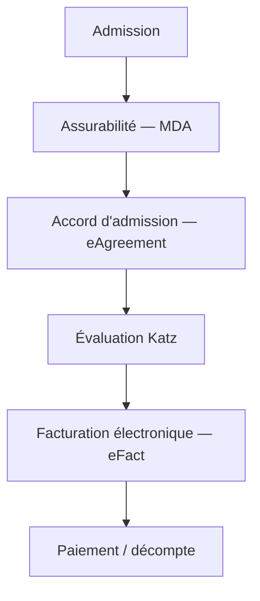

# Le parcours de facturation

De l'**admission** au **paiement**, une facture correcte suit toujours les mêmes
étapes. Cette page relie l'ensemble du parcours ; chaque étape renvoie vers sa page
détaillée.



```text
Admission ─► MDA ─► eAgreement ─► Katz ─► eFact ─► Paiement
```

1. **Admission** — Créez le dossier du résident et ouvrez son séjour.
   → [Gérer un résident](residents/gerer-un-resident.md)
2. **Assurabilité (MDA)** — Vérifiez l'assurabilité et la mutuelle exacte auprès de
   MyCareNet / WalCareNet. → [Assurabilité (MDA)](ehealth/mda.md)
3. **Accord d'admission (eAgreement)** — La notification de prise en charge (Annexe 7)
   est préparée pour la mutuelle. → [Accords (eAgreement)](ehealth/eagreement.md)
4. **Évaluation Katz** — Cotez la dépendance : la catégorie Katz est déclarée à la
   mutuelle pour le forfait INAMI. → [L&#39;évaluation Katz](residents/katz.md)
5. **Facturation électronique (eFact)** — Générez la période, créez les factures et
   transmettez la part mutuelle aux organismes assureurs.
   → [Facturation électronique (eFact)](ehealth/efact.md)
6. **Paiement / décompte** — La part résident est facturée, la part mutuelle suivie
   jusqu'au décompte de l'OA (accusé, acceptation, rejet).
   → [Facturer un mois, pas à pas](facturation/facturer-un-mois.md)

!!! tip "En pratique"
    L'**assurabilité (MDA)** en début de mois et une **évaluation Katz validée** sont
    les deux préalables qui évitent la plupart des rejets eFact. Traitez-les avant de
    générer les factures.

## Pour aller plus loin

- [FAQ — Questions fréquentes](faq.md)
- [Glossaire](glossaire.md)
- [Vue d&#39;ensemble de la facturation](facturation/index.md)
