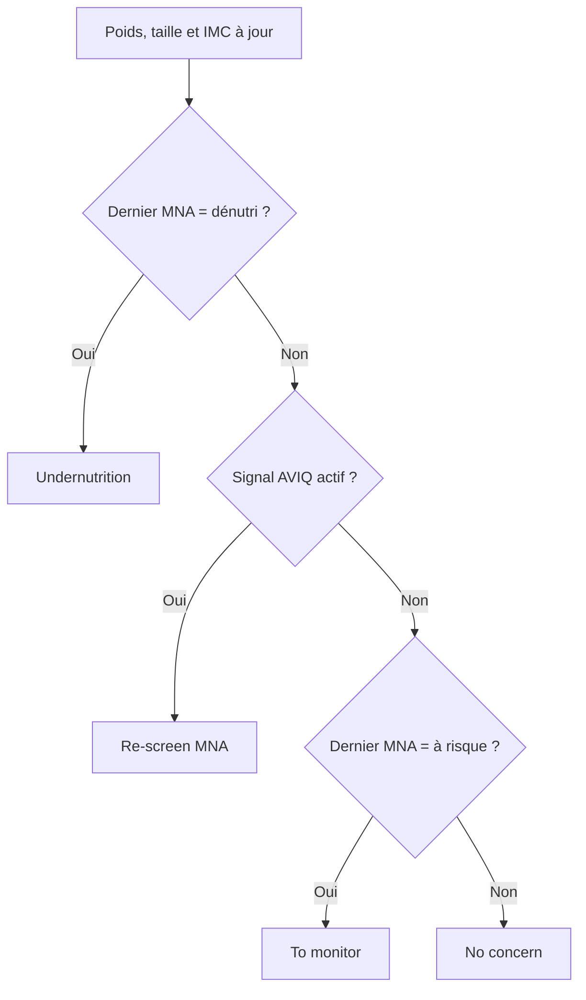

# Le suivi nutritionnel et la dénutrition

Resthome dépiste la **dénutrition** et suit les **apports** de chaque résident,
en s'appuyant sur les recommandations gériatriques **ESPEN** et les règles de
dépistage **AVIQ**. Tout se lit dans l'**onglet Nutrition** de la fiche du
résident et se pilote depuis le **tableau de bord des Repas**.

Le principe est simple : vous saisissez le **poids**, les **repas servis** et les
**boissons** ; Resthome en déduit un **statut de risque de dénutrition**, des
**cibles** d'énergie, de protéines et de liquides, une **couverture** des apports,
et lève des **alertes** quand un résident décroche.

!!! info "Un outil de dépistage, pas un diagnostic"
    Le suivi nutritionnel aide l'équipe à repérer tôt les résidents fragiles. Il
    ne remplace pas l'évaluation d'un **diététicien** ou d'un **médecin** : le
    statut et les alertes sont des signaux à interpréter, pas des décisions.

## L'onglet Nutrition du résident

Ouvrez un résident (application **Résidents** ou **Repas**), puis l'onglet
**Nutrition**. L'onglet n'apparaît que pour les résidents. Il regroupe le statut
de dénutrition, le dernier MNA, les cibles ESPEN, les apports, les régimes et les
préférences alimentaires.

<!-- capture à ajouter : onglet Nutrition d'une fiche résident, montrant le statut de dénutrition, le dernier MNA et les cibles ESPEN -->

### Le statut de risque de dénutrition

Le bloc **Undernutrition Status** (« statut de dénutrition ») est en **lecture
seule** : Resthome le calcule, vous ne le modifiez pas à la main. Il affiche un
badge coloré et les mesures qui l'expliquent.

| Statut affiché | Signification | Couleur du badge |
|---|---|---|
| **No concern** | Aucune préoccupation | Vert |
| **To monitor** | À surveiller (dernier MNA « à risque ») | Bleu |
| **Re-screen (MNA)** | Un signal AVIQ est actif : refaire ou renouveler le MNA | Orange |
| **Undernutrition** | Dénutrition confirmée (dernier MNA « dénutri ») | Rouge |

Sous le badge, l'onglet montre le **poids**, l'**IMC**, un indicateur **Low BMI**
(IMC bas ajusté à l'âge) et la **perte de poids** sur 1 mois et sur 6 mois.

!!! note "Ce qui déclenche « Re-screen (MNA) »"
    Un **signal AVIQ** est actif dès que l'une de ces conditions est vraie :

    - **perte de poids** de plus de **5 %** sur environ 1 mois ;
    - **perte de poids** de plus de **10 %** sur environ 6 mois ;
    - **IMC inférieur à 23** chez un résident de **plus de 70 ans** (seuil ajusté à l'âge) ;
    - **MNA échu** : aucun MNA, ou dernier MNA de plus de 6 mois.

    Les seuils correspondent aux valeurs par défaut du dépistage AVIQ/PWNS-be-A.

!!! warning "Pesez régulièrement pour obtenir la perte de poids"
    La perte de poids sur 1 et 6 mois se calcule à partir des **poids consignés
    dans les signes vitaux** (notes infirmières). Sans pesées régulières, Resthome
    ne peut pas comparer et ces pourcentages restent à zéro. La **taille** est
    nécessaire pour l'**IMC**.

### Le dernier MNA

Le bloc **Latest MNA** (« dernier MNA ») résume la dernière évaluation **MNA**
(Mini Nutritional Assessment) du résident : **date**, **score** et
**interprétation** (normal, à risque, dénutri).

Deux boutons y donnent accès :

- **New MNA** (« nouveau MNA ») ouvre une nouvelle évaluation MNA pré-remplie pour
  ce résident, avec la **bande d'IMC** déjà sélectionnée d'après son IMC connu.
- **MNA History** (« historique MNA ») ouvre la liste de ses MNA précédents.

Le MNA-SF est une échelle sur **14 points** : **12–14** = statut normal,
**8–11** = à risque de dénutrition, **0–7** = dénutri. C'est le MNA qui fait
basculer le statut vers **Undernutrition** ou **To monitor**. Les évaluations sont
des **registres cliniques** : voir [Registres cliniques](../soins/registres.md).

### Les cibles ESPEN

Le bloc **Nutritional Needs (ESPEN)** (« besoins nutritionnels ») affiche la
cible **propre au résident**, déduite de son poids et de son sexe :

| Cible | Comment elle est calculée |
|---|---|
| **Energy Target (kcal/day)** — énergie | Poids × 30 kcal/kg (ou 35 si IMC inférieur ou égal à 21) |
| **Protein Target (g/day)** — protéines | Poids × 1 g/kg |
| **Fluid Target (ml/day)** — liquides | 1600 ml (femmes) / 2000 ml (hommes) |

Les **coefficients** (30/35 kcal, 1 g, 1,6/2,0 l) se règlent une fois pour toute
la maison dans [Réglages des repas et de la nutrition](../configuration/reglages-repas.md).
Resthome en déduit ensuite la cible individuelle de chaque résident.

### Apports vs besoins (moyenne 3 jours)

Le bloc **Intake vs Needs** (« apports vs besoins ») compare ce que le résident a
réellement consommé à ses cibles.

- La ligne **Today** montre l'apport du jour : **kcal**, **protéines (g)** et
  **liquides (ml)**.
- Trois barres de couverture — **Energy Coverage**, **Protein Coverage** et
  **Fluid Coverage** — donnent la **moyenne sur 3 jours** en pourcentage de la
  cible.
- Deux indicateurs **Nutrition Deficit** et **Hydration Deficit** passent à vrai
  quand la couverture tombe sous le seuil réglé (75 % par défaut).

Deux boutons complètent le bloc :

- **Log Drink** (« consigner une boisson ») enregistre rapidement une boisson pour
  ce résident.
- **Hydration History** (« historique d'hydratation ») ouvre son journal de
  boissons.

!!! tip "Pour que la couverture se remplisse"
    L'apport alimentaire vient des **services de repas** : à chaque repas, indiquez
    la **quantité mangée** (voir plus bas). Les **plats** doivent porter leurs
    **portions** et leurs valeurs **par portion** (kcal, protéines), sinon l'apport
    reste à zéro. L'hydratation vient des **boissons consignées**.

## Consigner les apports alimentaires

L'apport énergétique et protéique se déduit des **services de repas**. Sur un
service, le champ **Amount Eaten** (« quantité mangée ») propose : **Not Eaten**
(rien), **25 %**, **50 %**, **75 %** et **Fully Eaten** (entièrement).

Resthome multiplie la valeur nutritionnelle **par portion** des plats servis par
ce pourcentage pour obtenir l'apport réel du repas, puis fait la **moyenne sur 3
jours**. La saisie repas par repas se fait dans **Repas → Opérations** (Services
repas, Distribution) — voir [Menus, régimes et hydratation](menus-regimes.md).

## Enregistrer l'hydratation

Les boissons se consignent au fil de la journée dans **Repas → Opérations →
Hydratation**, une liste éditable directement (saisie rapide). Chaque ligne
indique le résident, l'heure, la **quantité en millilitres** et le **type de
boisson** : eau, café/thé, jus/soda, lait/laitage, soupe/bouillon, complément
oral, autre.

Vous pouvez aussi consigner une boisson en un clic depuis l'onglet Nutrition, avec
le bouton **Log Drink**. Resthome additionne les boissons du jour, calcule la
**couverture hydrique** sur 3 jours et lève une alerte si l'apport est insuffisant.

<!-- capture à ajouter : liste Hydratation en saisie rapide, Repas → Opérations → Hydratation -->

## Le tableau de bord nutritionnel

Ouvrez **Repas → Statistiques** : la page rassemble, sous les cartes générales
(Résidents, Menus, Alertes), trois bandeaux nutritionnels qui n'apparaissent que
s'ils concernent au moins un résident.

| Bandeau | Résidents concernés | Bouton |
|---|---|---|
| **Risque de dénutrition** (rouge) | Statut Re-dépistage MNA ou Dénutrition | **Review** ouvre la liste de ces résidents |
| **Déficit nutritionnel** (orange) | Apport sous la cible ESPEN | **Review** ouvre la liste de ces résidents |
| **Déficit d'hydratation** (bleu) | Apport en liquides sous la cible | **Review** ouvre la liste de ces résidents |

Chaque bouton **Review** ouvre la liste filtrée des résidents, sur leur fiche
complète (onglet Nutrition inclus) pour agir directement.

<!-- capture à ajouter : page Statistiques des Repas avec les trois bandeaux dénutrition / déficit / hydratation -->

## Les alertes automatiques

Un **cron quotidien** rafraîchit le dépistage et crée des **activités** pour les
résidents qui décrochent. Les activités sont limitées à **une fois par 30 jours**
par résident pour éviter les doublons.

| Alerte | Condition | Destinataire |
|---|---|---|
| **Dénutrition — refaire/renouveler le MNA** | Statut Re-dépistage MNA ou Dénutrition | Chef infirmier, sinon gestionnaire |
| **Déficit nutritionnel — apport sous la cible** | Couverture énergie ou protéines sous le seuil | Cuisine (diététicien), sinon chef infirmier, sinon gestionnaire |
| **Déficit d'hydratation — apport liquides sous la cible** | Couverture hydrique sous le seuil | Cuisine (diététicien), sinon chef infirmier, sinon gestionnaire |

En plus des activités, l'onglet Nutrition affiche un **bandeau d'avertissement** en
haut dès que le statut est Re-dépistage MNA ou Dénutrition, rappelant la perte de
poids et invitant à refaire le MNA.

!!! note "Réglez le seuil de déficit"
    Le seuil de **75 %** de couverture qui déclenche les alertes de déficit se
    modifie dans [Réglages des repas et de la nutrition](../configuration/reglages-repas.md).
    Baissez-le pour être alerté plus tard, montez-le pour l'être plus tôt.

## Points clés à retenir

- L'**onglet Nutrition** du résident réunit statut de dénutrition, dernier MNA,
  cibles ESPEN et couverture des apports — en lecture seule pour les mesures
  calculées.
- Le **statut de dénutrition** suit les règles AVIQ/ESPEN : perte de poids, IMC
  ajusté à l'âge, MNA échu ou MNA « dénutri ».
- Les **cibles** (énergie, protéines, liquides) sont propres à chaque résident,
  calculées depuis son poids et son sexe à partir des coefficients ESPEN réglables.
- L'**apport** se déduit de la **quantité mangée** aux repas et des **boissons
  consignées** ; la couverture est une moyenne sur 3 jours.
- Le **tableau de bord des Repas** (Statistiques) et les **alertes quotidiennes**
  remontent les résidents à risque ; ce suivi ne change **pas** le forfait, qui
  dépend du Katz.

## Pour aller plus loin

- [Menus, régimes et hydratation](menus-regimes.md)
- [Portail familles et kiosque](portail-familles.md)
- [Vue d'ensemble des Repas](index.md)
- [Registres cliniques (MNA)](../soins/registres.md)
- [Réglages des repas et de la nutrition](../configuration/reglages-repas.md)
- [Le forfait et la catégorie Katz](../residents/katz.md)