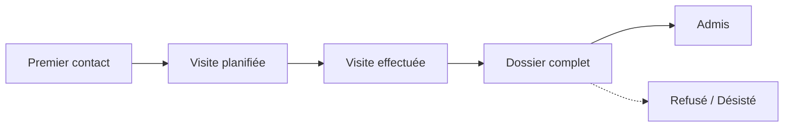

# Les admissions (pipeline CRM)

Le **pipeline d'admission** est le point d'entrée du parcours d'un résident. Il
vous permet de suivre chaque **candidat** — de la première demande d'un proche
jusqu'à l'entrée effective — puis, en un geste, de le **transformer en résident**
avec sa chambre et son séjour.

Vous le trouvez dans l'application **CRM**, sur l'équipe **Admissions**. Chaque
demande y devient une **piste** (un candidat résident) que vous faites progresser
d'étape en étape dans un tableau kanban.

## Vue d'ensemble

!!! note "Deux dates à ne pas confondre"
    - **Date de début de séjour** : quand commence la facturation de
      l'hébergement (la chambre). C'est celle que vous saisissez dans l'assistant
      d'admission.
    - **Date d'admission** : quand commence l'intervention de la mutuelle (le
      forfait de dépendance). Elle se fixe plus tard, au **démarrage du séjour**.

    Elles sont souvent identiques, mais peuvent différer.

## 1. Ouvrir le pipeline Admissions

1. Ouvrez l'application **CRM**.
2. Sélectionnez l'équipe / le pipeline **Admissions** (menu **Ventes → Mon
   pipeline**, puis filtrez sur l'équipe Admissions, ou ouvrez directement
   l'équipe depuis la vue des équipes).
3. Le tableau **kanban** affiche une colonne par étape et une carte par candidat.

<!-- capture a ajouter : le tableau kanban du pipeline Admissions avec ses colonnes Premier contact, Visite planifiée, etc. -->

## 2. Créer une piste d'admission

1. Cliquez sur **Nouveau**.
2. Donnez un **nom** à la piste (par exemple « Admission - Nom du candidat »).
3. La case **Candidat résident** est cochée automatiquement lorsque la piste
   appartient à l'équipe Admissions. Elle active l'onglet **Admission résident**
   et masque les sections commerciales (société, marketing) inutiles ici.
4. **Enregistrez.**

!!! tip "Le candidat et le proche qui appelle"
    Souvent, c'est un **proche** (fils, fille) qui prend contact pour la personne
    à héberger. Resthome distingue les deux : le **candidat résident** est la
    personne hébergée, tandis que l'appelant est enregistré comme **contact
    familial**. À l'admission, l'identité (NISS, date de naissance) est portée par
    le résident, pas par le proche.

### L'onglet « Admission résident »

C'est ici que vous constituez le dossier du candidat, sans quitter la piste :

- **Informations personnelles** : NISS, date de naissance, genre, médecin
  traitant, contacts familiaux, et surtout le **type de séjour souhaité**
  (MR, MRS ou court séjour).
- **Mutuelle / Assurabilité** : mutuelle, régime d'assurance, code d'affiliation,
  et le résultat de la **vérification MDA** (CT1/CT2, statut BIM).

!!! info "Court séjour (court séjour / CSJ)"
    Si vous choisissez **court séjour**, deux champs supplémentaires apparaissent :
    le **nombre de jours de court séjour déjà utilisés** cette année civile et des
    **notes**. La loi limite le court séjour à **90 jours par an** ; renseignez
    l'information (demandez à la famille, ou confirmez par téléphone avec la
    mutuelle) avant d'accepter l'admission.

<!-- capture a ajouter : l'onglet Admission résident d'une piste, avec les blocs Informations personnelles et Mutuelle / Assurabilité -->

## 3. Faire avancer la piste

Faites glisser la carte d'une colonne à l'autre, au rythme réel du dossier :

| Étape | Signification |
| --- | --- |
| **Premier contact** | Demande reçue, à recontacter. |
| **Visite planifiée** | Une visite de l'établissement est fixée. |
| **Visite effectuée** | La visite a eu lieu. |
| **Dossier complet** | Le dossier administratif et médical est prêt. |
| **Admis** | Étape « gagnée » : déclenche l'assistant d'admission. |
| **Refusé / Désisté** | La demande n'aboutit pas (colonne repliée). |

Vous pouvez aussi planifier les rendez-vous de visite directement depuis la piste
(bouton **Réunions** / calendrier partagé).

## 4. Vérifier l'assurabilité (MDA)

Avant de pouvoir admettre le candidat, vérifiez qu'il est bien assuré :

1. Sur la piste, cliquez sur **Vérifier l'assurabilité** (en-tête).
2. Resthome envoie une requête **MDA** (assurabilité MyCareNet / WalCareNet) et
   met à jour automatiquement la **mutuelle**, le statut **BIM** et les codes
   **CT1/CT2** du candidat.

!!! warning "Le contrôle MDA conditionne l'admission"
    Tant que la vérification MDA n'a pas **réussi**, le passage à l'étape
    **Admis** est **bloqué**. Pour un cas sans NISS (résident étranger,
    nouveau-né…), décochez **Contrôle MDA requis** dans l'onglet Admission
    résident pour lever le blocage. Si le MDA revient **non assuré**, l'admission
    reste possible mais Resthome vous avertit : la facturation devra alors être
    adressée au résident, pas à la mutuelle.

Pour tout comprendre du contrôle d'assurabilité, voir
[Assurabilité (MDA)](../ehealth/mda.md).

## 5. Admettre le candidat

Quand le dossier est prêt, transformez le candidat en résident. Deux gestes
équivalents ouvrent l'**assistant d'admission** :

- **Faire glisser** la carte dans la colonne **Admis**, ou
- Ouvrir la piste et cliquer sur le bouton **Gagné**.

!!! warning "Avant de marquer « Admis »"
    Le **type de séjour souhaité** (MR / MRS / court séjour) doit être renseigné :
    il détermine le lit et l'Annexe 7. Le contrôle MDA doit également être réussi
    (voir ci-dessus). À défaut, Resthome bloque l'opération et vous indique quoi
    compléter.

L'assistant d'admission vous demande :

1. La **chambre** — **obligatoire** ; seules les chambres **disponibles** sont
   proposées.
2. Le **type de séjour** — repris du candidat (MR / MRS / court séjour), en
   lecture seule.
3. La **date de début de séjour** — par défaut aujourd'hui.

Cliquez sur **Admettre** pour valider.

<!-- capture a ajouter : la fenêtre de l'assistant d'admission avec les champs Chambre, Type de séjour et Date de début de séjour -->

### Ce que l'admission crée

En validant l'assistant, Resthome :

- **crée le contact comme résident** (et le retire de la liste des futurs
  résidents) ;
- **ouvre le séjour** correspondant, à l'état **Confirmé**, sur la chambre et à
  la date choisies ;
- **ouvre la fiche du résident** pour poursuivre (Katz, documents, séjour).

Le séjour reste ensuite à **démarrer** (bouton **Start Stay**) quand le résident
est effectivement présent — c'est ce démarrage qui fixe la **date d'admission**
et déclenche la facturation. Voir [Gérer un résident](gerer-un-resident.md).

## Gardes-fous et cas particuliers

Resthome protège la cohérence du pipeline :

- **Annulation de l'assistant** — si vous fermez l'assistant sans admettre,
  la piste **revient à l'étape précédente** : rien n'est créé tant que vous
  n'avez pas validé.
- **Régression hors « Admis »** — si vous ressortez une piste déjà admise vers
  une étape antérieure, Resthome **annule automatiquement** les séjours encore en
  **brouillon** ou **confirmés** rattachés à cette piste. Un séjour déjà
  **démarré** (actif) n'est pas touché.
- **Détection de doublon** — l'admission est rattachée au **résident**, pas
  seulement à la piste. Si un séjour existe déjà pour cette personne, Resthome le
  réutilise plutôt que d'en créer un second ; un séjour confirmé appartenant à
  une **autre** piste n'est jamais « volé ».
- **Re-glisser une piste** — si vous rouvrez l'assistant sur une piste qui a déjà
  un séjour, la **chambre** de ce séjour est pré-remplie.

## Points clés à retenir

- Le pipeline **Admissions** vit dans l'application **CRM** ; chaque candidat est
  une piste que vous faites progresser en kanban.
- L'onglet **Admission résident** centralise l'identité, la mutuelle et le
  contrôle **MDA** du candidat.
- Le passage à **Admis** (glisser-déposer ou bouton **Gagné**) ouvre l'assistant :
  **chambre obligatoire** + **date de début de séjour**, puis création du
  **résident** et du **séjour**.
- L'admission est **bloquée** sans type de séjour renseigné et sans **MDA
  réussi** (sauf contrôle MDA décoché).
- Sortir une piste de **Admis** annule ses séjours **brouillon/confirmés** ; les
  séjours **actifs** sont préservés.

## Pour aller plus loin

- [Gérer un résident](gerer-un-resident.md)
- [L'évaluation Katz](katz.md)
- [Assurabilité (MDA)](../ehealth/mda.md)
- [Accords eAgreement](../ehealth/eagreement.md)
- [Parcours de facturation](../parcours-facturation.md)
