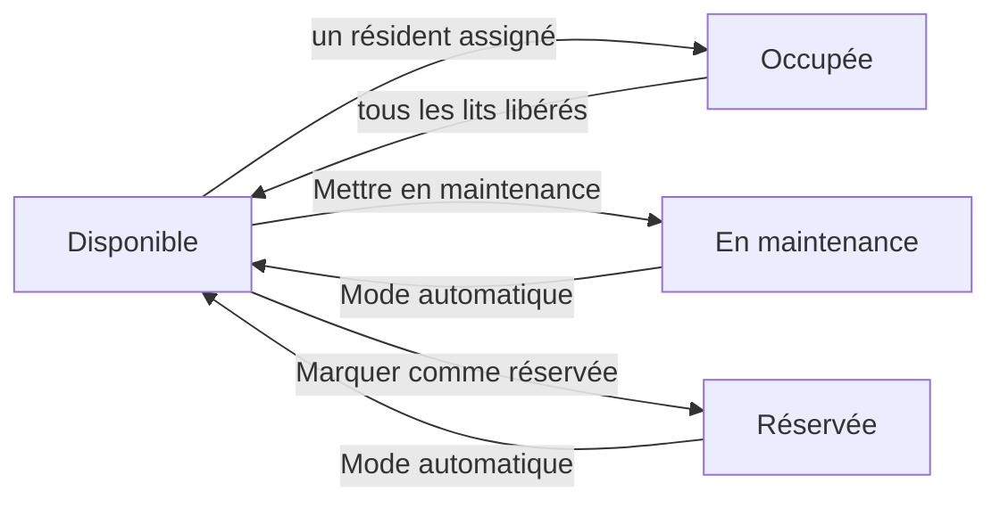

# Les chambres et l'occupation

L'espace **Chambres** vous donne une vue en temps réel de l'**occupation** de
l'établissement : quelles chambres sont libres, occupées, réservées ou en travaux,
combien de lits restent disponibles, et à quel tarif. Depuis une chambre, vous
pouvez aussi **assigner directement un résident**, ce qui ouvre son séjour.

Vous le trouvez dans l'application **MR/MRS → Hébergement → Chambres**.

## Le tableau d'occupation

À l'ouverture, les chambres s'affichent en **kanban**, regroupées par **statut** :
une colonne **Disponible**, une colonne **Occupée**, une colonne **En maintenance**
et une colonne **Réservée**. D'un coup d'œil, vous voyez où il reste de la place.

Chaque carte de chambre indique :

- le **numéro** de la chambre ;
- un **badge d'occupation** « occupées / capacité » (par exemple 1/1 ou 1/2),
  coloré selon le statut — vert (Disponible), bleu (Occupée), orange (Maintenance),
  cyan (Réservée) ;
- le **type de chambre** ;
- le ou les **résidents présents**, le cas échéant ;
- le **tarif journalier** de l'hébergement.

<!-- capture a ajouter : le tableau kanban des chambres, regroupé par statut, avec les badges d'occupation colorés -->

!!! note "Le badge occupation / capacité"
    Une chambre de capacité 2 dont un seul lit est pris s'affiche **1/2** et reste
    **Disponible** : il y a encore une place. Elle ne bascule en **Occupée** que
    lorsque **tous** les lits sont pris. Une chambre individuelle (capacité 1)
    passe donc directement de Disponible à Occupée dès le premier résident.

En haut à droite, vous pouvez basculer du **kanban** vers la **liste** (numéro,
étage, type, capacité, occupation, tarif, équipements, statut) ou la **fiche**.

### Filtrer et regrouper

La barre de recherche propose des **filtres** rapides : **Disponible**,
**Occupée**, **Maintenance**, **Réservée**, ainsi que **Active (hors maintenance)**.
Vous pouvez aussi **regrouper** les chambres par **État**, **Étage**, **Type** ou
**Secteur**, et rechercher par numéro, étage, bâtiment ou secteur.

## La fiche chambre

Cliquez sur une carte pour ouvrir la **fiche chambre**. En haut, une **barre de
statut** montre l'état courant (**Disponible → Occupée → En maintenance →
Réservée**), et des **rubans** signalent visuellement une chambre « Maintenance »
ou « Réservée ».

### Informations et tarif

| Champ | Rôle |
| --- | --- |
| **Numéro de chambre** | Identifiant unique de la chambre. |
| **Type de chambre** | Détermine le **tarif journalier** et la capacité par défaut. |
| **Étage** / **Bâtiment** | Localisation physique. |
| **Secteur** | Secteur / étage de l'établissement ; sert au regroupement et aux droits d'accès. |
| **Capacité** | Nombre de lits de la chambre. |
| **Occupation actuelle** | Nombre de lits occupés (calculé automatiquement). |
| **Tarif journalier** | Prix d'hébergement, repris du type de chambre. |
| **Article de facturation** | Produit lié à la chambre (lecture seule). |

!!! info "Le tarif journalier n'est pas le forfait INAMI"
    Le **tarif journalier** est le **prix de l'hébergement** (la chambre), une
    valeur **propre à votre établissement**, définie sur le **type de chambre**.
    Il est distinct du **forfait de dépendance** (la part mutuelle), qui dépend de
    la **catégorie Katz** du résident — la même pour toutes les catégories aux
    tarifs AViQ — et non de la chambre.

### Équipements

La section **Équipements** liste, sous forme d'étiquettes, ce dont dispose la
chambre (Télévision, Wifi, Salle de bain privée, Lit médicalisé, Appel infirmier,
Balcon…). Un champ **Notes équipements supplémentaires** permet d'ajouter une
précision en texte libre. Le catalogue d'équipements se gère dans les réglages
(voir [Configuration](../configuration/index.md)).

### Occupation actuelle et historique

Trois onglets complètent la fiche :

- **Occupation actuelle** — les résidents présents dans la chambre (nom, code
  résident, âge).
- **Historique des séjours** — tous les séjours qui ont concerné cette chambre,
  avec le résident, les dates de début et de fin, et l'état (**Brouillon**,
  **Confirmé**, **En cours**, **Terminé**).
- **Notes** — notes internes libres sur la chambre.

## Changer le statut d'une chambre

Le statut **Disponible / Occupée** est calculé automatiquement d'après
l'occupation. Vous pouvez toutefois **forcer** un statut manuel depuis l'en-tête
de la fiche :

- **Mettre en maintenance** — la chambre passe **En maintenance** (travaux,
  nettoyage approfondi, panne…) et n'est plus proposée à l'assignation.
- **Marquer comme réservée** — la chambre devient **Réservée** (par exemple pour
  une admission à venir) et sort des chambres disponibles.
- **Mode automatique** — annule l'override manuel : le statut est de nouveau
  **calculé automatiquement** d'après l'occupation.

!!! warning "Maintenance et Réservée bloquent l'assignation"
    Tant qu'une chambre est **En maintenance** ou **Réservée**, le bouton
    **Assigner un résident** est masqué et la chambre n'apparaît **pas** dans les
    listes de chambres disponibles (admission, transfert). Repassez-la en **Mode
    automatique** pour la rendre à nouveau assignable.

## Assigner un résident depuis la chambre

Vous pouvez ouvrir un séjour directement depuis une chambre libre, sans passer par
le pipeline d'admission :

1. Ouvrez la fiche d'une chambre **Disponible** (ni pleine, ni en maintenance, ni
   réservée — sinon le bouton n'apparaît pas).
2. Cliquez sur **Assigner un résident**.
3. Dans l'assistant, choisissez le **résident** (seuls les résidents sont
   proposés).
4. Vérifiez la **date d'entrée** (aujourd'hui par défaut) et, si besoin, la
   **date de fin prévue**.
5. Le **tarif journalier** est repris de la chambre ; ajustez le champ
   **Facturer à** si la facture doit être adressée à un tiers (proche, CPAS).
6. Ajoutez éventuellement un **motif d'admission**, puis cliquez sur **Assigner
   un résident**.

Resthome crée alors le **séjour** sur cette chambre, à l'état **En cours**, et
vous ramène sur la fiche de la chambre.

<!-- capture a ajouter : l'assistant Assigner un résident, avec les champs Résident, Date d'entrée, Tarif journalier et Facturer à -->

### Cas du résident déjà logé : le transfert

Si le résident choisi **occupe déjà une chambre**, l'assistant le détecte et
affiche un **avertissement de transfert** rappelant sa chambre actuelle. Le bouton
devient alors **Transférer le résident**. En confirmant, Resthome **termine**
l'ancien séjour (motif : *transfert*) et **ouvre** un nouveau séjour dans la
chambre choisie.

!!! note "Assigner ≠ Changer de chambre"
    Assigner depuis la chambre un résident **déjà logé** effectue un **transfert**
    simple. Pour un changement de chambre qui **scinde proprement la facturation**
    de l'hébergement à la date exacte tout en gardant l'intervention INAMI
    **continue** (sans nouvel accord), préférez l'action **Changer de chambre** sur
    le **séjour** — voir
    [Changement de chambre et transfert](changement-chambre.md).

## Configurer les types de chambres et l'équipement

La structure des chambres se prépare dans la configuration, via **MR/MRS →
Configuration → Chambres** :

- **Types de chambres** — définissez chaque type (individuelle, double…), son
  **tarif journalier**, sa **capacité par défaut** et l'**article de facturation**
  associé. Le tarif d'une chambre découle de son type.
- **Équipement de chambre** — tenez le **catalogue** des équipements proposés
  (confort, médical, technologie, extérieur), que vous cochez ensuite sur chaque
  fiche chambre.

Pour le détail des réglages, voir [Configuration](../configuration/index.md).

## Points clés à retenir

- Le tableau d'occupation vit dans **MR/MRS → Hébergement → Chambres**, en
  **kanban regroupé par statut** (Disponible, Occupée, En maintenance, Réservée).
- Le **badge** de chaque carte montre l'occupation « occupées / capacité » et sa
  couleur reflète le statut ; une chambre partagée reste **Disponible** tant qu'un
  lit est libre.
- Les boutons **Mettre en maintenance** / **Marquer comme réservée** forcent un
  statut ; **Mode automatique** rend le calcul automatique.
- Une chambre **en maintenance** ou **réservée** n'est **pas** assignable.
- **Assigner un résident** depuis la chambre crée le séjour ; si le résident est
  déjà logé, l'opération devient un **transfert**.
- Le **tarif journalier** est le prix d'hébergement propre à l'établissement (par
  type de chambre), à ne pas confondre avec le **forfait de dépendance** lié à Katz.

## Pour aller plus loin

- [Gérer un résident](gerer-un-resident.md)
- [Changement de chambre et transfert](changement-chambre.md)
- [L'état des lieux](etat-des-lieux.md)
- [Configuration](../configuration/index.md)