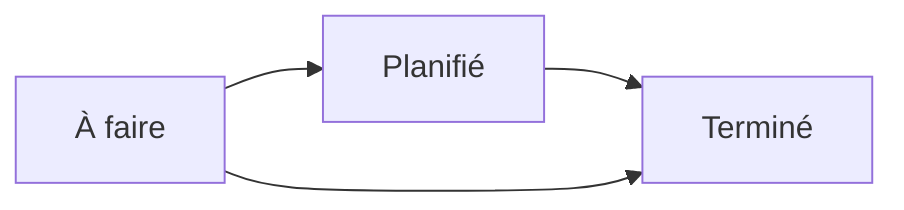

# L'état des lieux (entrée et sortie)

L'**état des lieux** consigne l'**état d'une chambre** et de ses équipements à un
moment précis : à l'**entrée** du résident, puis à sa **sortie**. C'est un
**constat contradictoire** à valeur légale, signé par le résident (ou son
représentant) et par l'établissement. Vous le trouvez dans le menu
**Hébergement ▸ États des lieux**.

Chaque état des lieux relie un **résident**, une **chambre** et un
**représentant**, liste les **équipements** constatés (conformes ou non), et
produit un **rapport PDF** à votre en-tête, prêt à signer.

!!! info "Un module optionnel"
    Les états des lieux sont fournis par un module dédié. S'il est installé, une
    entrée **États des lieux** apparaît dans le menu **Hébergement**, aux côtés
    des **Chambres** et des **Séjours**.

## 1. Créer l'état des lieux

1. Ouvrez **Hébergement ▸ États des lieux**.
2. Cliquez sur **Nouveau**.
3. Sélectionnez le **Résident**.
4. Vérifiez la **Date** (par défaut, la date du jour) et le **Responsable** (par
   défaut, vous).
5. **Enregistrez** : une **référence** automatique est attribuée (préfixe `EL-`).

!!! tip "Le résident, la chambre et le représentant se relient tout seuls"
    Dès que vous choisissez le **résident**, Resthome pré-remplit :

    - la **Chambre**, reprise de son **séjour en cours** ;
    - le **Représentant du résident** (personne de référence qui signera),
      repris de son **premier contact famille**.

    Ces deux champs restent modifiables si besoin.

<!-- capture à ajouter : formulaire d'un état des lieux avec le résident sélectionné, la chambre et le représentant pré-remplis -->

## 2. Choisir le type : entrée ou sortie

Renseignez le champ **Type d'état des lieux** :

- **Entrée** — l'état de la chambre au moment de l'**arrivée** du résident.
- **Sortie** — l'état au moment du **départ**, à comparer avec l'entrée.

Le type détermine le **badge** affiché sur le rapport PDF (Entrée / Sortie).

!!! note "Type non précisé"
    Si vous ne choisissez pas de type, le rapport affiche le badge
    **Non précisé**. Renseignez Entrée ou Sortie pour un document clair.

## 3. Remplir les lignes de détail

Ouvrez l'onglet **Détails**. Chaque ligne décrit un **équipement** et son état.
Trois boutons sont disponibles au bas de la liste :

- **Ajouter une ligne** — un équipement constaté ;
- **Ajouter une section** — un titre qui regroupe des lignes (ex. « Chambre »,
  « Salle de bain », « Mobilier ») ;
- **Ajouter une note** — une ligne de texte libre, en italique.

Pour une ligne d'équipement, renseignez :

| Champ | Rôle |
|---|---|
| **Équipement** | L'élément constaté (obligatoire) |
| **État** | **Conforme** ou **Non conforme** (obligatoire) |
| **Photo** | Une photo de l'élément (facultatif) |
| **Notes** | Une observation libre |

!!! warning "Équipement et état obligatoires"
    Une ligne de détail doit toujours porter un **équipement** et un **état**
    (Conforme / Non conforme). Les sections et les notes, elles, ne portent ni
    équipement ni état : ce sont de simples titres ou remarques.

<!-- capture à ajouter : onglet Détails avec des lignes par équipement (état Conforme / Non conforme), une section et une photo -->

Une seconde page, **Observations générales**, permet d'ajouter un texte libre sur
l'état d'ensemble de la chambre.

### Le catalogue d'équipements

Les lignes pointent vers le **catalogue d'équipements** de l'établissement
(« Équipement de chambre »), partagé avec la gestion des chambres. Vous y
définissez une fois pour toutes le lit, l'armoire, la télévision, la salle de
bain, etc. Voir [Le mobilier et les équipements](mobilier.md).

### Les modèles réutilisables

Pour ne pas ressaisir la même liste à chaque fois, utilisez un **modèle**.

1. Créez vos modèles dans **Configuration ▸ États des lieux ▸ Modèles d'état des
   lieux**.
2. Sur un état des lieux, choisissez le **Modèle d'état des lieux** : ses lignes,
   sections et observations générales pré-remplissent le document.

!!! tip "Comme un modèle de devis"
    Un modèle fonctionne comme un modèle de devis : il pose la structure
    (sections + équipements) que vous n'avez plus qu'à constater et compléter.

## 4. Suivre le cycle de vie

Un état des lieux passe par quatre **statuts**, visibles dans la barre d'état et
en colonnes dans la vue kanban :

| Statut | Signification |
|---|---|
| **À faire** | Créé, constat pas encore réalisé (statut initial) |
| **Planifié** | Le constat est planifié |
| **Terminé** | Le constat est réalisé et clôturé |
| **Annulé** | L'état des lieux est abandonné |

Les boutons en haut du formulaire font avancer le dossier :

- **Planifier** — passe de *À faire* à *Planifié* ;
- **Marquer comme terminé** — passe à *Terminé* ;
- **Réinitialiser à À faire** — revient à *À faire* depuis *Terminé* ou *Annulé* ;
- **Annuler** — bascule en *Annulé*.

<!-- capture à ajouter : vue kanban des états des lieux groupés par statut (À faire / Planifié / Terminé / Annulé) -->

## 5. Générer le rapport PDF signé

Depuis un état des lieux, utilisez **Imprimer ▸ État des lieux**. Resthome produit
un document `EDL_<référence>.pdf` à la charte de votre établissement.

Le rapport reprend :

- votre **en-tête** (logo, nom, adresse, TVA) et la **couleur** de votre
  établissement — définie dans **Paramètres ▸ Configurer la mise en page des
  documents** ;
- le titre **ÉTAT DES LIEUX** avec le **badge Entrée** (vert) ou **Sortie**
  (orange) selon le type ;
- les **métadonnées** : résident, chambre, responsable du constat, représentant,
  date, étiquettes ;
- les **observations générales**, si vous en avez saisi ;
- le **détail des éléments constatés** (équipement, état, photo, observation) ;
- un **récapitulatif** : nombre d'éléments, dont conformes et non conformes ;
- deux cadres de **signatures contradictoires** — *Le représentant du résident*
  et *Pour l'établissement* — sous la mention « Fait à …, en deux exemplaires » ;
- une **annexe photographique** reprenant les photos en grand format (4 par page).

!!! info "Prêt pour la signature électronique (Odoo Sign)"
    Le rapport contient des **ancres de signature** invisibles à l'impression,
    posées pour l'application **Odoo Sign** : lorsqu'une demande de signature est
    créée, les champs *représentant* et *établissement* se placent au bon endroit.
    Le pied de page mentionne la conformité au **règlement eIDAS (UE) n° 910/2014**.
    L'usage d'Odoo Sign est optionnel : à défaut, imprimez le PDF et faites-le
    signer à la main.

<!-- capture à ajouter : première page du rapport PDF avec le badge Entrée, le récapitulatif et les cadres de signature contradictoires -->

## Points clés à retenir

- L'état des lieux est un **constat contradictoire** à valeur légale : entrée puis
  sortie, signé par le représentant du résident et l'établissement.
- Le **résident**, la **chambre** (reprise du séjour) et le **représentant** se
  pré-remplissent automatiquement.
- Chaque ligne porte un **équipement** et un état **Conforme / Non conforme**,
  avec photo et observation ; les **sections** et **notes** structurent la liste.
- Les **modèles** évitent de ressaisir la même liste ; le **catalogue
  d'équipements** est partagé avec les chambres.
- Le **rapport PDF** est à votre charte, avec badge Entrée/Sortie, récapitulatif,
  signatures et annexe photos, prêt pour **Odoo Sign** (eIDAS).

## Pour aller plus loin

- [Gérer un résident](gerer-un-resident.md)
- [Changement de chambre et transfert](changement-chambre.md)
- [Le mobilier et les équipements](mobilier.md)
- [Réglages généraux (résidents, chambres)](../configuration/reglages-generaux.md)