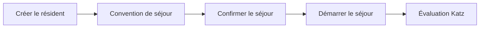

# Gérer un résident

Cette page décrit le parcours complet d'un résident dans Resthome : de sa
**création** à son **séjour actif**, en passant par l'**évaluation Katz** qui
conditionne la facturation INAMI.

## Vue d'ensemble

!!! note "Deux dates à ne pas confondre"
    - **Date de début de séjour** : quand commence la facturation de
      l'hébergement (la chambre).
    - **Date d'admission** : quand commence l'intervention INAMI (le forfait).

    Elles sont souvent identiques, mais peuvent différer — Resthome gère les deux.

## 1. Créer le résident

1. Ouvrez l'application **MR/MRS → Résidents**.
2. Cliquez sur **Nouveau**.
3. Renseignez au minimum : **nom**, **date de naissance**, **genre**, et le
   **NISS** (numéro national) s'il est connu.
4. Sélectionnez la **mutuelle** du résident.
5. **Enregistrez**.

!!! warning "Le NISS est nécessaire pour l'eHealth"
    Sans NISS, la vérification d'assurabilité (MDA) et les accords (eAgreement)
    ne peuvent pas être envoyés. Vous pouvez créer le résident sans NISS, mais
    pensez à le compléter dès que possible.

## 2. Ouvrir une convention de séjour

Le **séjour** relie le résident à une chambre et déclenche la facturation.

1. Sur la fiche du résident, ouvrez l'onglet **Convention de séjour**.
2. Cliquez sur **Ajouter une ligne**.
3. Choisissez la **chambre** (seules les chambres disponibles sont proposées).
4. Indiquez le **type de séjour** (MR ou MRS) et la **date de début de séjour**.
5. **Enregistrez**.

Le séjour est alors en état **Brouillon**.

## 3. Confirmer puis démarrer le séjour

Le séjour passe par deux étapes :

1. **Confirmer** — le séjour devient *Confirmé* (la chambre est réservée). Les
   champs **date et heure d'admission** apparaissent : complétez-les.
2. **Start Stay (Démarrer)** — le séjour devient *En cours* (le résident est
   effectivement présent).

!!! tip "Ce que le démarrage déclenche automatiquement"
    Au démarrage, Resthome :

    - ajoute le résident aux **périodes de facturation** ouvertes ;
    - crée, pour un résident facturé en avance, la **première facture
      d'hébergement** du mois d'admission ;
    - ouvre l'**enveloppe de suppléments** du mois ;
    - crée l'**eAgreement d'admission** (si le NISS est présent).

## 4. Saisir l'évaluation Katz

La catégorie **Katz** (O, A, B, C, Cd) détermine le **forfait INAMI**.

1. Depuis la fiche du résident, ouvrez **Outils d'évaluation → Katz** (ou le
   bouton **Katz**).
2. Cliquez sur **Nouveau** et cotez les 6 critères (toilette, habillage,
   transfert, aller à la toilette, continence, manger).
3. **Confirmez** puis **Validez** l'évaluation.

!!! note "Pas de Katz validé ?"
    Tant qu'aucun Katz validé n'existe, le résident est en catégorie **O** par
    défaut, et un rappel « Katz à faire » apparaît sur le tableau de bord.

## 5. Vérifier l'assurabilité (MDA)

Avant de facturer, vérifiez que le résident est bien assuré :

1. Ouvrez la période de facturation du mois, ou la fiche du résident.
2. Lancez une **vérification MDA** (assurabilité MyCareNet/WalCareNet).
3. Resthome met à jour automatiquement la **mutuelle** et le statut **BIM** le
   cas échéant.

## Cas particuliers

- **Changement de chambre** : utilisez l'action dédiée sur le séjour — la
  facturation de l'hébergement est scindée aux deux tarifs, sans nouvelle
  admission.
- **Transfert MR ↔ MRS** : un assistant enregistre la date de transfert et met à
  jour le type de séjour.
- **Absence / hospitalisation** : voir la section
  [Facturation](../facturation/index.md) — l'absence ajuste le forfait et peut
  générer une notification eHealth (Annexe 11).
- **Fin de séjour / décès** : clôturez le séjour ; Resthome arrête la
  facturation à la bonne date et prépare, si nécessaire, la note de crédit.

## Pour aller plus loin

- [Facturation](../facturation/index.md)
- [eHealth](../ehealth/index.md)
