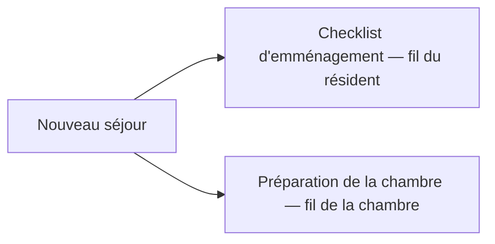

# La procédure d'emménagement

À chaque **nouveau séjour** — admission, changement de chambre, transfert interne
ou réadmission — Resthome ouvre automatiquement la **procédure d'emménagement** du
résident : une **checklist d'activités administratives** sur le fil du résident, et
la **préparation de la chambre** côté technique. Rien à déclencher à la main : les
tâches apparaissent dans les **activités** des responsables concernés et sur les
fils correspondants.

Vous choisissez ces responsables dans **Réglages ▸ Maison de repos ▸ Hébergement**.

!!! info "Une automatisation optionnelle"
    Les deux automatisations ne se déclenchent que si le **responsable**
    correspondant est défini dans les réglages. Tant qu'un champ est vide,
    l'automatisation reste silencieuse — pratique pour un import de données ou une
    mise en route progressive.

## Ce qui se déclenche à chaque nouveau séjour

Dès qu'un **séjour** est créé (par le [wizard d'admission](admissions.md), la
conversion d'une opportunité CRM, ou un
[changement de chambre / transfert](changement-chambre.md)), Resthome planifie en
même temps les **deux volets** de la procédure. L'échéance de toutes les activités
est la **date de début du séjour**.

| Événement | Checklist résident | Préparation de la chambre |
|---|---|---|
| **Admission initiale** | 6 tâches | Préparer la nouvelle chambre |
| **Changement de chambre** | 6 tâches | Préparer la nouvelle chambre **et** remettre l'ancienne en état |
| **Transfert interne** (MR ↔ MRS) | 6 tâches | Préparer la nouvelle chambre **et** remettre l'ancienne en état |
| **Réadmission** | 6 tâches | Préparer la chambre (pas de remise en état — l'ancienne était déjà libérée) |

!!! note "Sans doublon"
    Les activités sont **idempotentes** : si vous enregistrez à nouveau le séjour,
    Resthome ne réempile pas une activité identique déjà ouverte. Un séjour
    **annulé**, ou sans chambre ni résident, ne génère aucune tâche.

## La checklist d'emménagement (six tâches)

La checklist est planifiée sur le **fil du résident** (activité de type
**Procédure d'emménagement**), assignée au **Responsable procédure d'emménagement**.
Elle comporte six tâches :

| Tâche | À quoi elle sert |
|---|---|
| **Signer l'accord avec le représentant du résident** | Faire signer la convention d'hébergement avec la personne de référence |
| **État des lieux entrée / sortie** | Réaliser le constat contradictoire de la chambre (voir [L'état des lieux](etat-des-lieux.md)) |
| **Mettre à jour l'inventaire privé du résident** | Recenser le mobilier privé apporté pour la nouvelle chambre (voir [Le mobilier](mobilier.md)) |
| **Mettre à jour le casier à médicaments** | Déplacer / réétiqueter le casier à médicaments de la chambre |
| **Mettre à jour la buanderie** | Mettre à jour le service linge du résident |
| **Désinfecter la nouvelle / l'ancienne chambre** | Désinfecter la chambre d'arrivée (et l'ancienne, lors d'un changement de chambre) |

!!! tip "Cochez ce qui s'applique"
    La liste est **la même** pour une première admission et pour un changement de
    chambre. Le responsable **marque comme fait** ou **supprime** les étapes sans
    objet — par exemple, il n'y a pas d'ancienne chambre à désinfecter lors d'une
    première entrée.

<!-- capture à ajouter : fil (chatter) d'un résident avec les 6 activités « Procédure d'emménagement » planifiées à la date de début du séjour -->

## La préparation de la chambre

En parallèle, Resthome planifie la **préparation de la chambre** sur le **fil de la
chambre** (activité de type **Préparation de chambre**), assignée au **Responsable
technique chambres** :

- **Préparer la chambre — arrivée de …** : toujours planifiée sur la **chambre
  d'arrivée**, à la date de début du séjour.
- **Remettre la chambre en état — départ de …** : planifiée sur la **chambre
  quittée**, uniquement lors d'un **changement de chambre** ou d'un **transfert
  interne** (là où le résident libère réellement une chambre occupée).

!!! note "Pas de remise en état à l'entrée ni à la réadmission"
    L'activité « Remettre la chambre en état » n'est **pas** créée pour une
    première admission (aucune chambre précédente) ni pour une réadmission
    (l'ancienne chambre a déjà été libérée et nettoyée lors du départ précédent).

## Définir les responsables

Les deux automatisations s'appuient sur deux champs de configuration, propres à
votre établissement. Rendez-vous dans **Réglages ▸ Maison de repos ▸ Hébergement** :

1. **Responsable procédure d'emménagement** — l'utilisateur qui reçoit la checklist
   du résident (les 6 tâches ci-dessus). Laisser vide **désactive** la checklist.
2. **Responsable technique chambres** — l'utilisateur qui reçoit les activités de
   **préparation** et de **remise en état** des chambres. Laisser vide **désactive**
   ces activités.

!!! warning "Sans responsable, pas d'activités"
    Si un champ reste vide, l'automatisation correspondante ne crée **aucune**
    activité. Désignez au moins le **Responsable procédure d'emménagement** pour
    profiter de la checklist à chaque nouveau séjour.

<!-- capture à ajouter : section Hébergement des réglages avec les champs Responsable technique chambres et Responsable procédure d'emménagement -->

## Points clés à retenir

- La procédure d'emménagement se déclenche **automatiquement** à l'ouverture de
  tout nouveau séjour : admission, changement de chambre, transfert interne,
  réadmission.
- Elle comporte deux volets : une **checklist de 6 tâches** sur le fil du résident
  et la **préparation de la chambre** sur le fil de la chambre.
- Toutes les activités ont pour **échéance la date de début du séjour** et sont
  assignées aux **responsables** configurés.
- Les six tâches : **accord**, **état des lieux**, **inventaire privé**, **casier à
  médicaments**, **buanderie**, **désinfection** — le responsable clôture ou
  supprime celles sans objet.
- On désigne les responsables dans **Réglages ▸ Maison de repos ▸ Hébergement** ;
  un champ vide **désactive** l'automatisation correspondante.

## Pour aller plus loin

- [Gérer un résident](gerer-un-resident.md)
- [Changement de chambre et transfert](changement-chambre.md)
- [L'état des lieux (entrée et sortie)](etat-des-lieux.md)
- [Réglages généraux (résidents, chambres)](../configuration/reglages-generaux.md)
