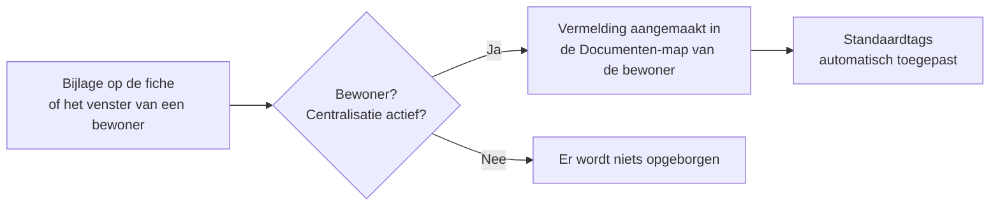

# De automatische centralisatie van bijlagen

In een woonzorgcentrum stapelt eenzelfde bewoner tientallen stukken op: verblijfsovereenkomst,
medische formulieren, afrekeningen van de mutualiteit, GDPR-toestemmingen… Zonder klassering
raken die bestanden verspreid over de discussievensters. De **automatische centralisatie**
lost dat op: **elke bijlage die op de fiche of het discussievenster van een bewoner wordt
gezet, wordt gekopieerd naar zijn persoonlijke map** in de **Documenten**-app, met de
**standaardtags**.

U hoeft niets te doen: het opbergen gebeurt **automatisch** en staat **standaard aan**. De
parametrering (activering, hoofdmap, tags) vindt u in **Instellingen > Documenten >
Bestandscentralisatie**, blok **Woonzorgcentrum**.

!!! info "Vereiste"
    Deze functie steunt op de Odoo **Documenten**-app: ze is enkel beschikbaar als
    Documenten geïnstalleerd is. De **hoofdmap van de bewoners** en de **persoonlijke map**
    van elke bewoner worden automatisch aangemaakt — u hoeft niets voor te bereiden.

## Hoe het werkt

Zodra een bestand aan een bewoner wordt gehecht — hetzij **als bijlage bij een bericht in
het discussievenster**, hetzij **rechtstreeks op zijn fiche** — maakt Resthome een
overeenkomstige vermelding aan in de Documenten-app, binnen de map van die bewoner.

Drie voorwaarden zetten het opbergen in gang:

- de fiche is die van een **bewoner** (een als bewoner gemarkeerde persoon);
- de **centralisatie** is **geactiveerd** voor de instelling;
- de **Documenten**-app is geïnstalleerd.

Ontbreekt er één, dan blijft de bijlage gewoon aan het bericht of de fiche gehecht, zonder
kopie in Documenten.

!!! note "Wat NIET wordt gecentraliseerd"
    De centralisatie geldt **enkel voor bewoners**. Bijlagen op een **gewoon contact**, een
    **leverancier** of een **werknemer** worden niet naar de Documenten-app gekopieerd.

## Waar de documenten terechtkomen

Elk gecentraliseerd document wordt opgeborgen in de **persoonlijke map van de bewoner**, die
zelf onder de hoofdmap **« Residents »** staat. Bij de opname (of bij het activeren van de
bewonersfiche) wordt die persoonlijke map automatisch aangemaakt, met drie klaargezette
submappen:

- **Medical documents** (medische documenten)
- **Administrative documents** (administratieve documenten)
- **Billing documents** (facturatiedocumenten)

De map draagt de **naam van de bewoner** en wordt automatisch hernoemd als de naam wijzigt.

<!-- capture toe te voegen : persoonlijke map van een bewoner in de Documenten-app, met de drie submappen -->

!!! tip "De knop « Documenten » op de bewonersfiche"
    Op de fiche van een bewoner opent de knop **Documenten** (teller bovenaan de fiche)
    **rechtstreeks** zijn map in de Documenten-app. De teller omvat de stukken uit de
    **submappen**, niet enkel die aan de basis van de map.

## De standaardtags

Op elk gecentraliseerd document past Resthome automatisch de voor de instelling gekozen
**standaardtags** toe (**Instellingen > Documenten > Bestandscentralisatie >
Standaardtags**). Daardoor kunt u de documenten nadien snel **filteren** en **terugvinden**
in de Documenten-app.

Resthome levert al een lijst klaargezette tags, afgestemd op de sector:

| Tag | Typisch gebruik |
|---|---|
| **Katz** | Afhankelijkheidsevaluaties |
| **Einde verblijf** | Uitstroom- of overlijdensdocumenten |
| **eAgreement** | WZC/RVT-akkoorden (zorgovereenkomst) |
| **VI** | Afrekeningen en brieven van de verzekeringsinstelling |
| **Overeenkomst** | Overeenkomst |
| **Medisch formulier** | Medische formulieren en attesten |
| **Facturatie** | Afrekeningen en facturen |
| **OCMW** | OCMW-tenlastenemingen |
| **GDPR** | Toestemmingen en GDPR-documenten |

!!! tip "Begin licht"
    De **Standaardtags** zijn **optioneel**. Laat het veld bij de start **leeg**, of zet er
    één algemene tag in: u kunt elk document achteraf altijd fijner labelen in de
    Documenten-app.

## Wie de documenten kan zien

De gecentraliseerde documenten **erven de rechten van de bewonersmap**: enkel gebruikers met
toegang tot de **Documenten**-app raadplegen ze. Ze hebben geen individuele eigenaar, zodat
een bestand niet aan één medewerker « toebehoort » en de volledige bewonersmap coherent en
beheerbaar blijft voor het team.

!!! note "Afgeschermd per instelling"
    Bij multi-vennootschap heeft **elke instelling haar eigen hoofdmap « Residents »** en
    haar eigen centralisatie-instelling. De documenten van een bewoner blijven dus
    afgeschermd binnen zijn vennootschap.

## Activeren of uitschakelen

De centralisatie staat **standaard aan**. U stuurt ze aan met het blok **Woonzorgcentrum**
in **Instellingen > Documenten > Bestandscentralisatie**:

- het blok **aanvinken activeert** het automatisch opbergen;
- het blok **uitvinken stopt** de centralisatie van **toekomstige** bijlagen — de reeds
  opgeborgen documenten **blijven staan**, er wordt niets verwijderd of verplaatst.

De drie instellingen (activering, **hoofdmap**, **standaardtags**) worden in detail
beschreven op de pagina [Documentinstellingen](../configuration/reglages-documents.md).

## Belangrijkste punten

- Elke bijlage op het **discussievenster** of de **fiche** van een bewoner wordt
  **automatisch gekopieerd** naar zijn Documenten-map.
- Het opbergen geldt **enkel voor bewoners** — niet voor contacten, leveranciers of
  werknemers.
- De **standaardtags** van de instelling worden **automatisch toegepast** op elk
  gecentraliseerd document.
- De **persoonlijke map** van de bewoner (en zijn submappen) wordt automatisch aangemaakt;
  de knop **Documenten** op de fiche opent ze rechtstreeks.
- De centralisatie staat **standaard aan** en wordt uitgeschakeld door het blok
  **Woonzorgcentrum** uit te vinken — de reeds opgeborgen documenten blijven staan.
- De instelling en de hoofdmap zijn **eigen aan elke instelling**.

## Verder

- [Documenten](index.md)
- [Documentinstellingen](../configuration/reglages-documents.md)
- [Een bewoner beheren](../residents/gerer-un-resident.md)
