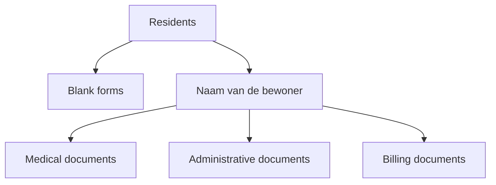

# De documenten van de bewoner

Resthome houdt voor **elke bewoner** een **documentmap** bij, opgeborgen in de
Odoo **Documenten**-app. U hoeft niets handmatig aan te maken of te klasseren:
de map, de submappen en het opbergen gebeuren automatisch. U bereikt ze via de
knop **Documenten** op de fiche van de bewoner, of via de applicatie
**Documenten → Residents**.

!!! info "Vereiste"
    Deze functie steunt op de Odoo **Documenten**-app: die moet geïnstalleerd
    zijn. Eenmaal actief worden de bewonersmappen en de labels automatisch
    opgezet — u hoeft niets voor te bereiden.

## Eén map per bewoner, automatisch aangemaakt

Zodra een bewoner wordt aangemaakt (of zodra zijn fiche een bewonersfiche wordt),
maakt Resthome zijn **persoonlijke map** aan onder de hoofdmap **« Residents »**,
met **drie klaargezette submappen**:

| Submap | Wat u erin opbergt |
|---|---|
| **Medical documents** (medische documenten) | Evaluaties, formulieren en medische stukken van de bewoner. |
| **Administrative documents** (administratieve documenten) | Overeenkomst, identiteitsstukken, akkoorden, briefwisseling. |
| **Billing documents** (facturatiedocumenten) | Facturen en stukken in verband met de facturatie van de bewoner. |

De map draagt de **naam van de bewoner** en wordt **automatisch hernoemd** als de
naam wijzigt. De mappen worden **alfabetisch gesorteerd**, zodat ze makkelijk te
doorlopen blijven in de Documenten-app.

!!! note "Beschermde mappen"
    De automatisch aangemaakte mappen zijn **beschermd tegen verwijdering**: een
    gewone gebruiker kan er documenten in plaatsen en raadplegen, maar de map zelf
    niet verwijderen. Zo verliest u niet per ongeluk de volledige
    documentstructuur van een bewoner.

<!-- capture toe te voegen: map van een bewoner in de Documenten-app met de drie submappen Medical / Administrative / Billing documents -->

## De knop « Documenten » op de fiche

Op de fiche van de bewoner toont een **slimme knop « Documenten »** het **aantal
bestanden** in zijn map. De teller telt de documenten van de map **en van zijn
submappen** samen (de submappen zelf worden niet meegeteld). Op de knop klikken
**opent rechtstreeks** de persoonlijke map van de bewoner in de Documenten-app.

!!! tip "Voorbehouden aan gebruikers van de Documenten-app"
    De knop verschijnt alleen voor gebruikers die toegang hebben tot de
    **Documenten**-applicatie. De anderen zien de bewonersfiche gewoon verder,
    zonder de snelkoppeling.

<!-- capture toe te voegen: bewonersfiche met de slimme knop « Documenten » en de teller rechtsboven -->

## De mappen die op instellingsniveau worden aangemaakt

Bij het aanmaken van de vennootschap (de instelling) zet Resthome automatisch twee
mappen bovenaan in de Documenten-app klaar:

- **Residents** — de hoofdmap die alle bewonersmappen bevat.
- **Blank forms** — een submap voor uw **sjablonen** en in te vullen documenten
  (type-overeenkomsten, blanco medische formulieren, enz.).

!!! note "Afgeschermd per instelling"
    Bij multi-vennootschap heeft **elke instelling haar eigen hoofdmap**
    « Residents » en haar eigen map « Blank forms ». Zo blijven de documenten
    gescheiden van het ene huis tot het andere.

## De vooraf gedefinieerde labels

Resthome levert een lijst klaargezette **labels** (tags) om documenten te
**categoriseren** en via een **filter terug te vinden** in de Documenten-app:

| Label | Typisch gebruik |
|---|---|
| **Katz** | Roosters en verslagen van de Katz-afhankelijkheidsevaluatie. |
| **Medisch formulier** | Medische formulieren en documenten. |
| **eAgreement** | Akkoorden van de verzekeringsinstelling (eAgreement). |
| **VI** | Beslissingen en toewijzingen van de verzekeringsinstelling. |
| **Overeenkomst** | De met de bewoner ondertekende verblijfsovereenkomst. |
| **Facturatie** | Facturen en facturatiestukken. |
| **OCMW** | Documenten van OCMW-tenlasteneming. |
| **GDPR** | Toestemmingen en documenten inzake privacy. |
| **Einde verblijf** | Documenten van einde verblijf / vertrek. |

!!! tip "Labels automatisch toepassen"
    U kunt een of meer van deze tags **automatisch** laten toepassen op elk
    gecentraliseerd document, via het veld **Standaardtags** in de instellingen.
    Zie [Documentinstellingen](../configuration/reglages-documents.md).

## Het automatisch opbergen van bijlagen

Naast de mappen kan Resthome de bijlagen die op de fiche van een bewoner worden
gezet **automatisch centraliseren**: ze belanden rechtstreeks in zijn persoonlijke
map, zonder handmatig klasseren. Dit gedrag stelt u in de configuratie in.

!!! info "Meer weten"
    De gedetailleerde werking, de gebruiksgevallen en de activering worden
    beschreven op de pagina [De centralisatie van documenten](centralisation.md).

## Kernpunten om te onthouden

- Elke bewoner beschikt over een **automatische persoonlijke map** met drie
  submappen: **medisch**, **administratief**, **facturatie**.
- De map volgt de **naam van de bewoner** en hernoemt zichzelf; de mappen zijn
  **beschermd tegen** accidentele **verwijdering**.
- De **knop « Documenten »** op de fiche opent de map en telt de bestanden,
  submappen inbegrepen.
- Op instellingsniveau maakt Resthome de mappen **« Residents »** en
  **« Blank forms »** aan, **afgeschermd per vennootschap**.
- Negen vooraf gedefinieerde **labels** (Katz, eAgreement, GDPR, OCMW…)
  vergemakkelijken het filteren en kunnen automatisch worden toegepast.

## Verder

- [De centralisatie van documenten](centralisation.md)
- [Een bewoner beheren](../residents/gerer-un-resident.md)
- [Documentinstellingen](../configuration/reglages-documents.md)
- [FAQ](../faq.md) · [Woordenlijst](../glossaire.md)
