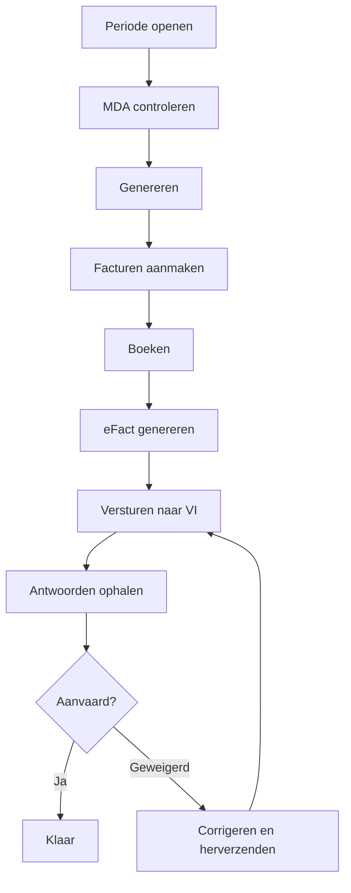

# Een maand factureren, stap voor stap

Deze gids begeleidt u **van begin tot eind** van een facturatiemaand: de periode
openen, de verzekerbaarheid controleren, de facturen genereren, ze boeken, en
daarna **het mutualiteitsaandeel via eFact versturen** en de antwoorden opvolgen.
Volg ze met Resthome ernaast open: elke stap geeft aan **waar te klikken**.

!!! tip "Het idee in twee delen"
    Elke maand wordt gefactureerd in **twee stromen**:

    - het **bewonersaandeel** — huisvesting, supplementen en supplementenovereenkomsten,
      zorgprestaties, geneesmiddelen, aangepast aan de afwezigheden → klassieke facturen;
    - het **mutualiteitsaandeel** (RIZIV-forfait) → **eFact**-verzending naar de
      verzekeringsinstellingen.

    Resthome voert ze parallel uit op eenzelfde **periode**.

## Stap 1 — De maandperiode openen

1. Hoofdmenu → toepassing **MR/MRS**.
2. **Facturatie → Facturatieperiodes**.
3. Open de periode van de maand, of maak ze aan met **Nieuwe periode**.

De periode toont de betrokken bewoners en haar **status** bovenaan (concept →
gegenereerd → gefactureerd → afgesloten).

## Stap 2 — De verzekerbaarheid controleren (MDA)

Vóór u de mutualiteit factureert, controleer dat iedereen **in orde** is:

1. Klik op de periode op **MDA controleren** (bulkcontrole).
2. Wacht op de antwoorden; corrigeer de gesignaleerde gevallen (verkeerde
   mutualiteit, verlies van verzekerbaarheid).

Dit is de stap die latere weigeringen vermijdt. Details: [Verzekerbaarheid
(MDA)](../ehealth/mda.md).

## Stap 3 — De factuurregels genereren

1. Klik **Genereren**.
2. Resthome berekent voor elke bewoner: **verblijf**, **forfait** (op de
   aanwezigheidsdagen), **supplementen** en **supplementenovereenkomsten**,
   **zorgprestaties**, **geneesmiddelen**, en past de **afwezigheden** toe.

!!! note "Anticipatief"
    Het verblijf wordt **een maand op voorhand** gefactureerd; het forfait en de
    supplementen op de gepresteerde maand. Zie [Overzicht](index.md).

## Stap 4 — De facturen aanmaken (bewonersaandeel)

1. Klik **Facturen aanmaken**.
2. De **concept**facturen van het bewonersaandeel worden gegenereerd.
3. Kijk ze na, en **boek** ze.

!!! warning "Een geboekte factuur « bevriest » de maand"
    Eenmaal **geboekt** is de factuur van een bewoner vergrendeld voor die maand
    (bescherming). Om ze te corrigeren: zet ze terug naar **concept** of maak een
    **creditnota**, en **vernieuw** dan. De andere bewoners worden niet geraakt.

## Stap 5 — De eFact genereren (mutualiteitsaandeel)

Zodra de facturen geboekt zijn:

1. Klik op de periode op **eFact genereren**.
2. Resthome stelt de eFact-**loten** samen, **gegroepeerd per unie** van
   verzekeringsinstellingen.

## Stap 6 — Versturen naar de verzekeringsinstellingen

1. Open **eHealth → eFact → Cockpit** (of de loten).
2. Klik **Alles versturen** (of verstuur lot per lot).
3. De verzendingen vertrekken naar de mutualiteiten via het eHealth-netwerk.

## Stap 7 — De antwoorden opvolgen

1. Klik **Antwoorden ophalen** om de ontvangstbewijzen en afrekeningen binnen te
   halen.
2. Elk lot gaat **Verstuurd → Ontvangstbewijs ontvangen → Aanvaard / Geweigerd**.
3. Bij een **weigering**, corrigeer de oorzaak (verzekerbaarheid, data, bedragen)
   en **verstuur opnieuw**.

Details en geavanceerde knoppen: [Elektronische facturatie (eFact)](../ehealth/efact.md).

## Overzicht van het traject

## Verder

- [Verzekerbaarheid (MDA)](../ehealth/mda.md)
- [Elektronische facturatie (eFact)](../ehealth/efact.md)
- [Afwezigheden en hospitalisaties](absences.md)
- [Akkoorden (eAgreement)](../ehealth/eagreement.md)
