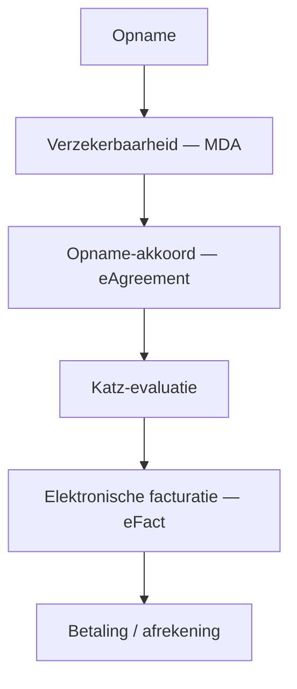

# Het facturatietraject

Van de **opname** tot de **betaling** volgt een correcte factuur altijd dezelfde
stappen. Deze pagina verbindt het hele traject; elke stap verwijst naar zijn
detailpagina.



```text
Opname ─► MDA ─► eAgreement ─► Katz ─► eFact ─► Betaling
```

1. **Opname** — Maak het bewonersdossier aan en open het verblijf.
   → [Een bewoner beheren](residents/gerer-un-resident.md)
2. **Verzekerbaarheid (MDA)** — Controleer de verzekerbaarheid en het exacte
   ziekenfonds bij MyCareNet / WalCareNet. → [Verzekerbaarheid (MDA)](ehealth/mda.md)
3. **Opname-akkoord (eAgreement)** — De melding van tenlasteneming (Bijlage 7) wordt
   voorbereid voor het ziekenfonds. → [Akkoorden (eAgreement)](ehealth/eagreement.md)
4. **Katz-evaluatie** — Scoor de afhankelijkheid: de Katz-categorie wordt aan het
   ziekenfonds gemeld voor het RIZIV-forfait. → [De Katz-evaluatie](residents/katz.md)
5. **Elektronische facturatie (eFact)** — Genereer de periode, maak de facturen aan en
   verstuur het ziekenfondsgedeelte naar de verzekeringsinstellingen.
   → [Elektronische facturatie (eFact)](ehealth/efact.md)
6. **Betaling / afrekening** — Het bewonersgedeelte wordt gefactureerd, het
   ziekenfondsgedeelte opgevolgd tot de afrekening van de VI (ontvangstbewijs,
   aanvaarding, weigering).
   → [Een maand factureren, stap voor stap](facturation/facturer-un-mois.md)

!!! tip "In de praktijk"
    De **verzekerbaarheid (MDA)** aan het begin van de maand en een **gevalideerde
    Katz-evaluatie** zijn de twee voorwaarden die de meeste eFact-weigeringen vermijden.
    Behandel ze vóór u de facturen genereert.

## Verder

- [FAQ — Veelgestelde vragen](faq.md)
- [Woordenlijst](glossaire.md)
- [Facturatie-overzicht](facturation/index.md)
