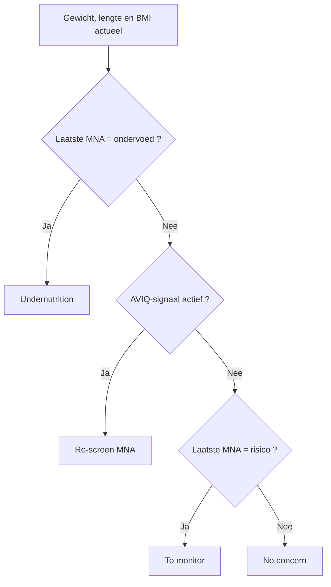

# Nutritionele opvolging en ondervoeding

Resthome spoort **ondervoeding** op en volgt de **inname** van elke bewoner op,
op basis van de geriatrische **ESPEN**-aanbevelingen en de **AVIQ**-screeningregels.
Alles leest u af in het **tabblad Nutrition** van de bewonersfiche en stuurt u vanuit
het **maaltijddashboard**.

Het principe is eenvoudig: u voert het **gewicht**, de **geserveerde maaltijden**
en de **dranken** in; Resthome leidt daaruit een **ondervoedingsrisicostatus**,
**streefwaarden** voor energie, eiwit en vocht, een **dekking** van de inname af,
en geeft **waarschuwingen** wanneer een bewoner achteruitgaat.

!!! info "Een screeningtool, geen diagnose"
    De nutritionele opvolging helpt het team om kwetsbare bewoners vroeg te
    herkennen. Ze vervangt de beoordeling van een **diëtist** of **arts** niet: de
    status en de waarschuwingen zijn signalen om te interpreteren, geen beslissingen.

## Het tabblad Nutrition van de bewoner

Open een bewoner (app **Bewoners** of **Maaltijden**) en daarna het tabblad
**Nutrition**. Het tabblad verschijnt enkel voor bewoners. Het bundelt de
ondervoedingsstatus, de laatste MNA, de ESPEN-streefwaarden, de inname, de diëten
en de voedingsvoorkeuren.

<!-- capture toe te voegen: tabblad Nutrition van een bewonersfiche, met de ondervoedingsstatus, de laatste MNA en de ESPEN-streefwaarden -->

### De ondervoedingsrisicostatus

Het blok **Undernutrition Status** (« ondervoedingsstatus ») staat in
**alleen-lezen**: Resthome berekent het, u past het niet manueel aan. Het toont
een gekleurde badge en de metingen die het verklaren.

| Getoonde status | Betekenis | Kleur van de badge |
|---|---|---|
| **No concern** | Geen bezorgdheid | Groen |
| **To monitor** | Op te volgen (laatste MNA « risico ») | Blauw |
| **Re-screen (MNA)** | Een AVIQ-signaal is actief: MNA opnieuw doen of hernieuwen | Oranje |
| **Undernutrition** | Bevestigde ondervoeding (laatste MNA « ondervoed ») | Rood |

Onder de badge toont het tabblad het **gewicht**, de **BMI**, een indicator **Low
BMI** (leeftijdsgecorrigeerde lage BMI) en het **gewichtsverlies** over 1 maand en
over 6 maanden.

!!! note "Wat « Re-screen (MNA) » in gang zet"
    Een **AVIQ-signaal** is actief zodra een van deze voorwaarden waar is:

    - **gewichtsverlies** van meer dan **5 %** over ongeveer 1 maand;
    - **gewichtsverlies** van meer dan **10 %** over ongeveer 6 maanden;
    - **BMI onder 23** bij een bewoner ouder dan **70** (leeftijdsgecorrigeerde drempel);
    - **vervallen MNA**: geen MNA, of laatste MNA ouder dan 6 maanden.

    De drempels komen overeen met de standaardwaarden van de AVIQ/PWNS-be-A-screening.

!!! warning "Weeg regelmatig om het gewichtsverlies te bekomen"
    Het gewichtsverlies over 1 en 6 maanden wordt berekend uit de **gewichten die
    in de vitale parameters** (verpleegkundige nota's) genoteerd zijn. Zonder
    regelmatige wegingen kan Resthome niet vergelijken en blijven die percentages op
    nul. De **lengte** is nodig voor de **BMI**.

### De laatste MNA

Het blok **Latest MNA** (« laatste MNA ») vat de laatste **MNA**-evaluatie (Mini
Nutritional Assessment) van de bewoner samen: **datum**, **score** en
**interpretatie** (normaal, risico, ondervoed).

Twee knoppen geven toegang:

- **New MNA** (« nieuwe MNA ») opent een nieuwe MNA-evaluatie, voorgevuld voor deze
  bewoner, met de **BMI-band** al geselecteerd op basis van zijn gekende BMI.
- **MNA History** (« MNA-geschiedenis ») opent de lijst van zijn vorige MNA's.

De MNA-SF is een schaal op **14 punten**: **12–14** = normale status, **8–11** =
risico op ondervoeding, **0–7** = ondervoed. Het is de MNA die de status naar
**Undernutrition** of **To monitor** doet omslaan. De evaluaties zijn **klinische
registers**: zie [Klinische registers](../soins/registres.md).

### De ESPEN-streefwaarden

Het blok **Nutritional Needs (ESPEN)** (« nutritionele behoeften ») toont de
streefwaarde **eigen aan de bewoner**, afgeleid uit zijn gewicht en geslacht:

| Streefwaarde | Hoe ze berekend wordt |
|---|---|
| **Energy Target (kcal/day)** — energie | Gewicht × 30 kcal/kg (of 35 als BMI kleiner dan of gelijk aan 21) |
| **Protein Target (g/day)** — eiwit | Gewicht × 1 g/kg |
| **Fluid Target (ml/day)** — vocht | 1600 ml (vrouwen) / 2000 ml (mannen) |

De **coëfficiënten** (30/35 kcal, 1 g, 1,6/2,0 l) stelt u één keer in voor het hele
woonzorgcentrum bij [Instellingen voor maaltijden en voeding](../configuration/reglages-repas.md).
Resthome leidt daarna de individuele streefwaarde van elke bewoner af.

### Inname vs behoeften (gemiddelde over 3 dagen)

Het blok **Intake vs Needs** (« inname vs behoeften ») vergelijkt wat de bewoner
werkelijk verbruikte met zijn streefwaarden.

- De regel **Today** toont de inname van de dag: **kcal**, **eiwit (g)** en
  **vocht (ml)**.
- Drie dekkingsbalken — **Energy Coverage**, **Protein Coverage** en **Fluid
  Coverage** — geven het **gemiddelde over 3 dagen** als percentage van de
  streefwaarde.
- Twee indicatoren **Nutrition Deficit** en **Hydration Deficit** worden waar
  wanneer de dekking onder de ingestelde drempel zakt (standaard 75 %).

Twee knoppen vervolledigen het blok:

- **Log Drink** (« een drank registreren ») registreert snel een drank voor deze
  bewoner.
- **Hydration History** (« hydratatiegeschiedenis ») opent zijn drankjournaal.

!!! tip "Opdat de dekking zich vult"
    De voedingsinname komt uit de **maaltijddiensten**: geef bij elke maaltijd de
    **gegeten hoeveelheid** aan (zie hieronder). De **gerechten** moeten hun
    **porties** en waarden **per portie** (kcal, eiwit) dragen, anders blijft de
    inname op nul. De hydratatie komt uit de **geregistreerde dranken**.

## De voedingsinname registreren

De energie- en eiwitinname wordt afgeleid uit de **maaltijddiensten**. Op een
dienst biedt het veld **Amount Eaten** (« gegeten hoeveelheid »): **Not Eaten**
(niets), **25 %**, **50 %**, **75 %** en **Fully Eaten** (volledig).

Resthome vermenigvuldigt de voedingswaarde **per portie** van de geserveerde
gerechten met dat percentage om de werkelijke inname van de maaltijd te bekomen, en
maakt daarna het **gemiddelde over 3 dagen**. De invoer maaltijd per maaltijd
gebeurt bij **Maaltijden → Operaties** (Maaltijddiensten, Distribution) — zie
[Menu's, diëten en hydratatie](menus-regimes.md).

## De hydratatie registreren

De dranken registreert u doorheen de dag bij **Maaltijden → Operaties →
Hydration**, een lijst die u rechtstreeks bewerkt (snelle invoer). Elke regel geeft
de bewoner, het uur, de **hoeveelheid in milliliter** en het **type drank**: water,
koffie/thee, sap/frisdrank, melk/zuivel, soep/bouillon, orale supplement, andere.

U kunt ook een drank in één klik registreren vanuit het tabblad Nutrition, met de
knop **Log Drink**. Resthome telt de dranken van de dag op, berekent de
**vochtdekking** over 3 dagen en geeft een waarschuwing als de inname onvoldoende is.

<!-- capture toe te voegen: lijst Hydratatie in snelle invoer, Maaltijden → Operaties → Hydration -->

## Het nutritionele dashboard

Open **Maaltijden → Statistics**: de pagina bundelt, onder de algemene kaarten
(Bewoners, Menu's, Waarschuwingen), drie nutritionele banners die enkel verschijnen
als ze minstens één bewoner betreffen.

| Banner | Betrokken bewoners | Knop |
|---|---|---|
| **Ondervoedingsrisico** (rood) | Status Herscreening MNA of Ondervoeding | **Review** opent de lijst van die bewoners |
| **Nutritioneel tekort** (oranje) | Inname onder de ESPEN-streefwaarde | **Review** opent de lijst van die bewoners |
| **Hydratatietekort** (blauw) | Vochtinname onder de streefwaarde | **Review** opent de lijst van die bewoners |

Elke knop **Review** opent de gefilterde lijst van bewoners, op hun volledige fiche
(tabblad Nutrition inbegrepen) om meteen te handelen.

<!-- capture toe te voegen: pagina Statistics van de Maaltijden met de drie banners ondervoeding / tekort / hydratatie -->

## De automatische waarschuwingen

Een **dagelijkse cron** vernieuwt de screening en maakt **activiteiten** aan voor
de bewoners die achteruitgaan. De activiteiten zijn beperkt tot **één keer per 30
dagen** per bewoner, om dubbels te vermijden.

| Waarschuwing | Voorwaarde | Ontvanger |
|---|---|---|
| **Ondervoeding — MNA opnieuw doen/hernieuwen** | Status Herscreening MNA of Ondervoeding | Hoofdverpleegkundige, anders beheerder |
| **Nutritioneel tekort — inname onder de streefwaarde** | Dekking energie of eiwit onder de drempel | Keuken (diëtist), anders hoofdverpleegkundige, anders beheerder |
| **Hydratatietekort — vochtinname onder de streefwaarde** | Vochtdekking onder de drempel | Keuken (diëtist), anders hoofdverpleegkundige, anders beheerder |

Naast de activiteiten toont het tabblad Nutrition bovenaan een
**waarschuwingsbanner** zodra de status Herscreening MNA of Ondervoeding is, die het
gewichtsverlies herhaalt en aanspoort om de MNA opnieuw te doen.

!!! note "Stel de tekortdrempel in"
    De drempel van **75 %** dekking die de tekortwaarschuwingen in gang zet, past u
    aan bij [Instellingen voor maaltijden en voeding](../configuration/reglages-repas.md).
    Verlaag hem om later gewaarschuwd te worden, verhoog hem om vroeger gewaarschuwd
    te worden.

## Kernpunten om te onthouden

- Het **tabblad Nutrition** van de bewoner brengt ondervoedingsstatus, laatste MNA,
  ESPEN-streefwaarden en dekking van de inname samen — in alleen-lezen voor de
  berekende metingen.
- De **ondervoedingsstatus** volgt de AVIQ/ESPEN-regels: gewichtsverlies,
  leeftijdsgecorrigeerde BMI, vervallen MNA of MNA « ondervoed ».
- De **streefwaarden** (energie, eiwit, vocht) zijn eigen aan elke bewoner,
  berekend uit gewicht en geslacht op basis van de instelbare ESPEN-coëfficiënten.
- De **inname** wordt afgeleid uit de **gegeten hoeveelheid** bij de maaltijden en
  de **geregistreerde dranken**; de dekking is een gemiddelde over 3 dagen.
- Het **maaltijddashboard** (Statistics) en de **dagelijkse waarschuwingen** brengen
  bewoners met risico naar boven; deze opvolging wijzigt het forfait **niet**, dat
  van de Katz afhangt.

## Meer weten

- [Menu's, diëten en hydratatie](menus-regimes.md)
- [Familieportaal en kiosk](portail-familles.md)
- [Overzicht van de Maaltijden](index.md)
- [Klinische registers (MNA)](../soins/registres.md)
- [Instellingen voor maaltijden en voeding](../configuration/reglages-repas.md)
- [Het forfait en de Katz-categorie](../residents/katz.md)