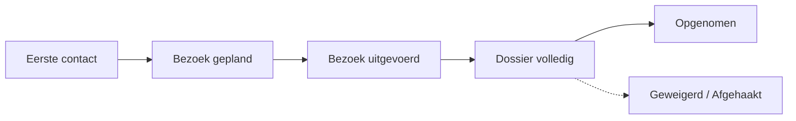

# De opnames (CRM-pijplijn)

De **opnamepijplijn** is het startpunt van het traject van een bewoner. Ermee
volgt u elke **kandidaat** — van de eerste aanvraag van een naaste tot de
effectieve intrede — en zet u hem daarna in één beweging **om in een bewoner**,
met zijn kamer en zijn verblijf.

U vindt hem in de **CRM**-toepassing, op het team **Admissions** (Opnames). Elke
aanvraag wordt er een **lead** (een kandidaat-bewoner) die u fase per fase laat
vorderen in een kanbanbord.

## Overzicht

!!! note "Twee data om niet te verwarren"
    - **Startdatum verblijf**: wanneer de facturatie van het verblijf (de kamer)
      begint. Die geeft u in de opname-assistent op.
    - **Opnamedatum**: wanneer de tegemoetkoming van de mutualiteit (het
      afhankelijkheidsforfait) begint. Die wordt later vastgelegd, bij het
      **starten van het verblijf**.

    Vaak zijn ze identiek, maar ze kunnen verschillen.

## 1. De opnamepijplijn openen

1. Open de **CRM**-toepassing.
2. Selecteer het team / de pijplijn **Admissions** (Opnames) (menu **Verkoop →
   Mijn pijplijn**, filter daarna op het team Opnames, of open het team
   rechtstreeks vanuit de teamweergave).
3. Het **kanbanbord** toont één kolom per fase en één kaart per kandidaat.

<!-- capture a ajouter : het kanbanbord van de opnamepijplijn met de kolommen Eerste contact, Bezoek gepland, enz. -->

## 2. Een opname-lead aanmaken

1. Klik op **Nieuw**.
2. Geef de lead een **naam** (bijvoorbeeld « Opname - naam van de kandidaat »).
3. Het vakje **Kandidaat-bewoner** wordt automatisch aangevinkt wanneer de lead
   tot het team Opnames behoort. Het activeert het tabblad **Opname bewoner** en
   verbergt de commerciële secties (bedrijf, marketing) die hier niet nodig zijn.
4. **Sla op.**

!!! tip "De kandidaat en de naaste die belt"
    Vaak neemt een **naaste** (zoon, dochter) contact op voor de op te nemen
    persoon. Resthome maakt het onderscheid: de **kandidaat-bewoner** is de
    gehuisveste persoon, terwijl de beller wordt geregistreerd als
    **familiecontact**. Bij de opname wordt de identiteit (NISS, geboortedatum)
    gedragen door de bewoner, niet door de naaste.

### Het tabblad « Opname bewoner »

Hier stelt u het dossier van de kandidaat samen, zonder de lead te verlaten:

- **Persoonlijke gegevens**: NISS, geboortedatum, geslacht, behandelend arts,
  familiecontacten en vooral het **gewenste verblijfstype** (ROB, RVT of kort
  verblijf).
- **Mutualiteit / Verzekerbaarheid**: mutualiteit, verzekeringsstelsel,
  aansluitingscode en het resultaat van de **MDA-controle** (CT1/CT2, BIM-status).

!!! info "Kort verblijf (kortverblijf / CSJ)"
    Als u **kort verblijf** kiest, verschijnen twee extra velden: het **aantal
    reeds gebruikte dagen kort verblijf** dit kalenderjaar en **notities**. De wet
    beperkt het kort verblijf tot **90 dagen per jaar**; vul de informatie in
    (vraag het aan de familie of bevestig telefonisch bij de mutualiteit) vóór u
    de opname aanvaardt.

<!-- capture a ajouter : het tabblad Opname bewoner van een lead, met de blokken Persoonlijke gegevens en Mutualiteit / Verzekerbaarheid -->

## 3. De lead laten vorderen

Versleep de kaart van de ene kolom naar de andere, op het werkelijke ritme van
het dossier:

| Fase | Betekenis |
| --- | --- |
| **Eerste contact** | Aanvraag ontvangen, opnieuw te contacteren. |
| **Bezoek gepland** | Een bezoek aan de instelling is vastgelegd. |
| **Bezoek uitgevoerd** | Het bezoek heeft plaatsgevonden. |
| **Dossier volledig** | Het administratieve en medische dossier is klaar. |
| **Opgenomen** | « Gewonnen » fase: start de opname-assistent. |
| **Geweigerd / Afgehaakt** | De aanvraag mislukt (ingeklapte kolom). |

U kunt de bezoekafspraken ook rechtstreeks vanuit de lead plannen (knop
**Vergaderingen** / gedeelde agenda).

## 4. De verzekerbaarheid controleren (MDA)

Vóór u de kandidaat kunt opnemen, controleert u of hij wel verzekerd is:

1. Klik op de lead op **Verzekerbaarheid controleren** (kopbalk).
2. Resthome verstuurt een **MDA**-aanvraag (verzekerbaarheid MyCareNet /
   WalCareNet) en werkt automatisch de **mutualiteit**, de **BIM**-status en de
   **CT1/CT2**-codes van de kandidaat bij.

!!! warning "De MDA-controle bepaalt de opname"
    Zolang de MDA-controle niet **geslaagd** is, is de overgang naar de fase
    **Opgenomen** **geblokkeerd**. Voor een geval zonder NISS (buitenlandse
    bewoner, pasgeborene…) vinkt u **MDA-controle vereist** uit in het tabblad
    Opname bewoner om de blokkering op te heffen. Als de MDA **niet verzekerd**
    terugkeert, blijft de opname mogelijk maar waarschuwt Resthome u: de
    facturatie moet dan aan de bewoner worden gericht, niet aan de mutualiteit.

Voor alle uitleg over de verzekerbaarheidscontrole, zie
[Verzekerbaarheid (MDA)](../ehealth/mda.md).

## 5. De kandidaat opnemen

Wanneer het dossier klaar is, zet u de kandidaat om in een bewoner. Twee
gelijkwaardige acties openen de **opname-assistent**:

- de kaart **verslepen** naar de kolom **Opgenomen**, of
- de lead openen en op de knop **Gewonnen** klikken.

!!! warning "Voordat u « Opgenomen » markeert"
    Het **gewenste verblijfstype** (ROB / RVT / kort verblijf) moet ingevuld zijn:
    het bepaalt het bed en Bijlage 7. Ook de MDA-controle moet geslaagd zijn (zie
    hierboven). Zo niet blokkeert Resthome de bewerking en geeft het aan wat u
    moet aanvullen.

De opname-assistent vraagt u:

1. De **kamer** — **verplicht**; enkel **beschikbare** kamers worden voorgesteld.
2. Het **verblijfstype** — overgenomen van de kandidaat (ROB / RVT / kort
   verblijf), alleen-lezen.
3. De **startdatum verblijf** — standaard vandaag.

Klik op **Opnemen** om te bevestigen.

<!-- capture a ajouter : het venster van de opname-assistent met de velden Kamer, Verblijfstype en Startdatum verblijf -->

### Wat de opname aanmaakt

Bij het bevestigen van de assistent doet Resthome:

- **het contact aanmaken als bewoner** (en het uit de lijst van toekomstige
  bewoners halen);
- **het bijhorende verblijf openen**, in de status **Bevestigd**, op de gekozen
  kamer en datum;
- **de fiche van de bewoner openen** om verder te gaan (Katz, documenten,
  verblijf).

Het verblijf moet nadien nog **gestart** worden (knop **Start Stay**) wanneer de
bewoner effectief aanwezig is — dat starten legt de **opnamedatum** vast en start
de facturatie. Zie [Een bewoner beheren](gerer-un-resident.md).

## Vangrails en bijzondere gevallen

Resthome beschermt de samenhang van de pijplijn:

- **Assistent annuleren** — als u de assistent sluit zonder op te nemen, keert de
  lead terug naar de **vorige fase**: er wordt niets aangemaakt zolang u niet
  bevestigd hebt.
- **Terugkeer uit « Opgenomen »** — als u een reeds opgenomen lead opnieuw naar
  een eerdere fase brengt, **annuleert** Resthome automatisch de verblijven die
  nog in **concept** of **bevestigd** zijn en aan die lead gekoppeld zijn. Een
  reeds **gestart** (lopend) verblijf blijft ongemoeid.
- **Detectie van dubbels** — de opname is gekoppeld aan de **bewoner**, niet enkel
  aan de lead. Bestaat er al een verblijf voor deze persoon, dan hergebruikt
  Resthome het in plaats van een tweede aan te maken; een bevestigd verblijf dat
  bij een **andere** lead hoort, wordt nooit « gestolen ».
- **Een lead opnieuw verslepen** — heropent u de assistent op een lead die al een
  verblijf heeft, dan wordt de **kamer** van dat verblijf voorgevuld.

## Kernpunten om te onthouden

- De pijplijn **Opnames** leeft in de **CRM**-toepassing; elke kandidaat is een
  lead die u in kanban laat vorderen.
- Het tabblad **Opname bewoner** centraliseert de identiteit, de mutualiteit en de
  **MDA**-controle van de kandidaat.
- De overgang naar **Opgenomen** (verslepen of knop **Gewonnen**) opent de
  assistent: **kamer verplicht** + **startdatum verblijf**, daarna aanmaak van de
  **bewoner** en het **verblijf**.
- De opname is **geblokkeerd** zonder ingevuld verblijfstype en zonder geslaagde
  **MDA** (behalve als de MDA-controle is uitgevinkt).
- Een lead uit **Opgenomen** halen annuleert zijn verblijven in
  **concept/bevestigd**; **lopende** verblijven blijven behouden.

## Verder lezen

- [Een bewoner beheren](gerer-un-resident.md)
- [De Katz-evaluatie](katz.md)
- [Verzekerbaarheid (MDA)](../ehealth/mda.md)
- [eAgreement-akkoorden](../ehealth/eagreement.md)
- [Facturatietraject](../parcours-facturation.md)
