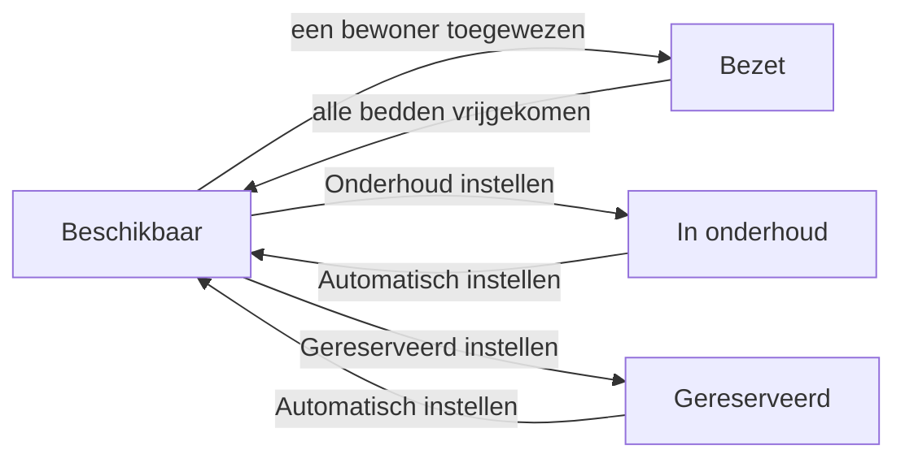

# De kamers en de bezetting

De ruimte **Kamers** geeft u een realtimebeeld van de **bezetting** van de
instelling: welke kamers vrij, bezet, gereserveerd of in werken zijn, hoeveel
bedden nog beschikbaar zijn en tegen welk tarief. Vanuit een kamer kunt u ook
**rechtstreeks een bewoner toewijzen**, wat zijn verblijf opent.

U vindt dit in de toepassing **MR/MRS → Huisvesting → Kamers**.

## Het bezettingsoverzicht

Bij het openen verschijnen de kamers in een **kanban**, gegroepeerd per **status**:
een kolom **Beschikbaar**, een kolom **Bezet**, een kolom **In onderhoud** en een
kolom **Gereserveerd**. In één oogopslag ziet u waar er nog plaats is.

Elke kamerkaart toont:

- het **nummer** van de kamer;
- een **bezettingsbadge** « bezet / capaciteit » (bijvoorbeeld 1/1 of 1/2),
  gekleurd volgens de status — groen (Beschikbaar), blauw (Bezet), oranje
  (Onderhoud), cyaan (Gereserveerd);
- het **kamertype**;
- de aanwezige **bewoner(s)**, indien van toepassing;
- het **dagtarief** van het verblijf.

<!-- capture a ajouter : het kanbanbord van de kamers, gegroepeerd per status, met de gekleurde bezettingsbadges -->

!!! note "De badge bezetting / capaciteit"
    Een kamer met capaciteit 2 waarvan één bed bezet is, toont **1/2** en blijft
    **Beschikbaar**: er is nog een plaats. Ze schakelt pas naar **Bezet** wanneer
    **alle** bedden bezet zijn. Een eenpersoonskamer (capaciteit 1) gaat dus
    meteen van Beschikbaar naar Bezet zodra de eerste bewoner er is.

Rechtsboven schakelt u van het **kanban** naar de **lijst** (nummer, verdieping,
type, capaciteit, bezetting, tarief, uitrusting, status) of de **fiche**.

### Filteren en groeperen

De zoekbalk biedt snelle **filters**: **Beschikbaar**, **Bezet**, **Onderhoud**,
**Gereserveerd**, en ook **Actief (niet in onderhoud)**. U kunt de kamers ook
**groeperen** per **Status**, **Verdieping**, **Type** of **Sector**, en zoeken op
nummer, verdieping, gebouw of sector.

## De kamerfiche

Klik op een kaart om de **kamerfiche** te openen. Bovenaan toont een **statusbalk**
de huidige staat (**Beschikbaar → Bezet → In onderhoud → Gereserveerd**), en
**linten** signaleren visueel een kamer « Onderhoud » of « Gereserveerd ».

### Informatie en tarief

| Veld | Rol |
| --- | --- |
| **Kamernummer** | Unieke identificatie van de kamer. |
| **Kamertype** | Bepaalt het **dagtarief** en de standaardcapaciteit. |
| **Verdieping** / **Gebouw** | Fysieke locatie. |
| **Sector** | Sector / verdieping van de instelling; dient voor groepering en toegangsrechten. |
| **Capaciteit** | Aantal bedden van de kamer. |
| **Huidige bezetting** | Aantal bezette bedden (automatisch berekend). |
| **Dagtarief** | Verblijfsprijs, overgenomen van het kamertype. |
| **Factureringsproduct** | Product gekoppeld aan de kamer (alleen-lezen). |

!!! info "Het dagtarief is niet het RIZIV-forfait"
    Het **dagtarief** is de **prijs van het verblijf** (de kamer), een waarde
    **eigen aan uw instelling**, ingesteld op het **kamertype**. Het staat los van
    het **afhankelijkheidsforfait** (het mutualiteitsaandeel), dat afhangt van de
    **Katz-categorie** van de bewoner — hetzelfde bedrag voor alle categorieën aan
    de AViQ-tarieven — en niet van de kamer.

### Uitrusting

De sectie **Uitrusting** toont, als labels, waarover de kamer beschikt (Televisie,
Wifi, Eigen badkamer, Verpleegbed, Verpleegoproep, Balkon…). Een veld **Aanvullende
uitrustingsinformatie** laat toe in vrije tekst een precisering toe te voegen. De
catalogus van uitrustingen beheert u in de instellingen (zie
[Configuratie](../configuration/index.md)).

### Huidige bezetting en geschiedenis

Drie tabbladen vervolledigen de fiche:

- **Huidige bezetting** — de bewoners die in de kamer aanwezig zijn (naam,
  bewonerscode, leeftijd).
- **Verblijfsgeschiedenis** — alle verblijven die deze kamer betroffen, met de
  bewoner, de begin- en einddatums en de staat (**Concept**, **Bevestigd**,
  **Lopend**, **Beëindigd**).
- **Notities** — vrije interne notities over de kamer.

## De status van een kamer wijzigen

De status **Beschikbaar / Bezet** wordt automatisch berekend op basis van de
bezetting. U kunt echter een handmatige status **forceren** vanuit de kop van de
fiche:

- **Onderhoud instellen** — de kamer gaat naar **In onderhoud** (werken, grondige
  reiniging, defect…) en wordt niet meer voor toewijzing aangeboden.
- **Gereserveerd instellen** — de kamer wordt **Gereserveerd** (bijvoorbeeld voor
  een toekomstige opname) en valt weg uit de beschikbare kamers.
- **Automatisch instellen** — heft de handmatige override op: de status wordt weer
  **automatisch berekend** op basis van de bezetting.

!!! warning "Onderhoud en Gereserveerd blokkeren de toewijzing"
    Zolang een kamer **In onderhoud** of **Gereserveerd** is, is de knop **Bewoner
    toewijzen** verborgen en verschijnt de kamer **niet** in de lijsten van
    beschikbare kamers (opname, overdracht). Zet ze terug op **Automatisch
    instellen** om ze opnieuw toewijsbaar te maken.

## Een bewoner toewijzen vanuit de kamer

U kunt een verblijf rechtstreeks vanuit een vrije kamer openen, zonder de
opnamepijplijn te doorlopen:

1. Open de fiche van een **Beschikbare** kamer (niet vol, niet in onderhoud, niet
   gereserveerd — anders verschijnt de knop niet).
2. Klik op **Bewoner toewijzen**.
3. Kies in de assistent de **bewoner** (enkel bewoners worden voorgesteld).
4. Controleer de **opnamedatum** (standaard vandaag) en, indien nodig, de
   **geplande einddatum**.
5. Het **dagtarief** wordt overgenomen van de kamer; pas het veld **Factuur aan**
   aan als de factuur naar een derde moet (naaste, OCMW).
6. Voeg eventueel een **reden van opname** toe en klik daarna op **Bewoner
   toewijzen**.

Resthome maakt dan het **verblijf** aan op deze kamer, in de staat **Lopend**, en
brengt u terug naar de kamerfiche.

<!-- capture a ajouter : de assistent Bewoner toewijzen, met de velden Bewoner, Opnamedatum, Dagtarief en Factuur aan -->

### Geval van een reeds gehuisveste bewoner: de overdracht

Als de gekozen bewoner **al een kamer bezet**, detecteert de assistent dit en toont
een **overdrachtswaarschuwing** met vermelding van zijn huidige kamer. De knop
wordt dan **Bewoner overbrengen**. Bij bevestiging **beëindigt** Resthome het oude
verblijf (reden: *overdracht*) en **opent** een nieuw verblijf in de gekozen kamer.

!!! note "Toewijzen ≠ Kamer wisselen"
    Een **reeds gehuisveste** bewoner toewijzen vanuit de kamer voert een eenvoudige
    **overdracht** uit. Voor een kamerwissel die de facturatie van het verblijf
    **netjes splitst** op de exacte datum en tegelijk de RIZIV-tegemoetkoming
    **doorlopend** houdt (zonder nieuw akkoord), gebruikt u beter de actie **Kamer
    wisselen** op het **verblijf** — zie
    [Kamerwissel en overdracht](changement-chambre.md).

## De kamertypes en de uitrusting configureren

De structuur van de kamers bereidt u voor in de configuratie, via **MR/MRS →
Configuratie → Kamers**:

- **Kamertypes** — bepaal elk type (eenpersoons, tweepersoons…), zijn
  **dagtarief**, zijn **standaardcapaciteit** en het bijbehorende
  **factureringsproduct**. Het tarief van een kamer volgt uit zijn type.
- **Kameruitrusting** — houd de **catalogus** bij van de aangeboden uitrustingen
  (comfort, medisch, technologie, buiten), die u vervolgens op elke kamerfiche
  aanvinkt.

Voor de details van de instellingen, zie [Configuratie](../configuration/index.md).

## Belangrijkste punten om te onthouden

- Het bezettingsoverzicht leeft in **MR/MRS → Huisvesting → Kamers**, in een
  **kanban gegroepeerd per status** (Beschikbaar, Bezet, In onderhoud,
  Gereserveerd).
- De **badge** van elke kaart toont de bezetting « bezet / capaciteit » en de kleur
  weerspiegelt de status; een gedeelde kamer blijft **Beschikbaar** zolang er een
  bed vrij is.
- De knoppen **Onderhoud instellen** / **Gereserveerd instellen** forceren een
  status; **Automatisch instellen** maakt de berekening weer automatisch.
- Een kamer **in onderhoud** of **gereserveerd** is **niet** toewijsbaar.
- **Bewoner toewijzen** vanuit de kamer maakt het verblijf aan; is de bewoner al
  gehuisvest, dan wordt de handeling een **overdracht**.
- Het **dagtarief** is de verblijfsprijs eigen aan de instelling (per kamertype),
  niet te verwarren met het **afhankelijkheidsforfait** gekoppeld aan Katz.

## Verder

- [Een bewoner beheren](gerer-un-resident.md)
- [Kamerwissel en overdracht](changement-chambre.md)
- [De plaatsbeschrijving](etat-des-lieux.md)
- [Configuratie](../configuration/index.md)