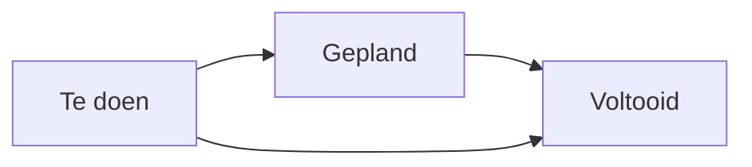

# De plaatsbeschrijving (intrede en uittrede)

De **plaatsbeschrijving** legt de **staat van een kamer** en haar uitrustingen op
een bepaald moment vast: bij de **intrede** van de bewoner, en later bij zijn
**uittrede**. Het is een **tegensprekelijke vaststelling** met juridische waarde,
ondertekend door de bewoner (of zijn vertegenwoordiger) en door de instelling. U
vindt ze in het menu **Huisvesting ▸ Plaatsbeschrijvingen**.

Elke plaatsbeschrijving koppelt een **bewoner**, een **kamer** en een
**vertegenwoordiger**, somt de vastgestelde **uitrustingen** op (conform of niet)
en levert een **PDF-verslag** met uw huisstijl, klaar om te ondertekenen.

!!! info "Een optionele module"
    De plaatsbeschrijvingen komen van een aparte module. Als die geïnstalleerd is,
    verschijnt een item **Plaatsbeschrijvingen** in het menu **Huisvesting**,
    naast de **Kamers** en de **Verblijven**.

## 1. De plaatsbeschrijving aanmaken

1. Open **Huisvesting ▸ Plaatsbeschrijvingen**.
2. Klik op **Nieuw**.
3. Selecteer de **Bewoner**.
4. Controleer de **Datum** (standaard vandaag) en de **Verantwoordelijke**
   (standaard uzelf).
5. **Sla op**: er wordt automatisch een **referentie** toegekend (voorvoegsel
   `EL-`).

!!! tip "Bewoner, kamer en vertegenwoordiger koppelen zich vanzelf"
    Zodra u de **bewoner** kiest, vult Resthome vooraf in:

    - de **Kamer**, overgenomen uit zijn **lopende verblijf**;
    - de **Vertegenwoordiger van de bewoner** (de referentiepersoon die
      ondertekent), overgenomen uit zijn **eerste familiecontact**.

    Beide velden blijven aanpasbaar indien nodig.

<!-- schermafbeelding toe te voegen: formulier van een plaatsbeschrijving met de gekozen bewoner en de vooraf ingevulde kamer en vertegenwoordiger -->

## 2. Het type kiezen: intrede of uittrede

Vul het veld **Type plaatsbeschrijving** in:

- **Intrede** — de staat van de kamer bij de **aankomst** van de bewoner.
- **Uittrede** — de staat bij het **vertrek**, te vergelijken met de intrede.

Het type bepaalt de **badge** op het PDF-verslag (Intrede / Uittrede).

!!! note "Type niet ingevuld"
    Kiest u geen type, dan toont het verslag de badge **Niet gepreciseerd**. Vul
    Intrede of Uittrede in voor een duidelijk document.

## 3. De detailregels invullen

Open het tabblad **Details**. Elke regel beschrijft een **uitrusting** en haar
staat. Onderaan de lijst staan drie knoppen:

- **Regel toevoegen** — een vastgestelde uitrusting;
- **Sectie toevoegen** — een titel die regels groepeert (bv. « Kamer »,
  « Badkamer », « Meubilair »);
- **Notitie toevoegen** — een vrije tekstregel, in cursief.

Voor een uitrustingsregel vult u in:

| Veld | Rol |
|---|---|
| **Uitrusting** | Het vastgestelde element (verplicht) |
| **Staat** | **Conform** of **Niet conform** (verplicht) |
| **Foto** | Een foto van het element (optioneel) |
| **Notities** | Een vrije opmerking |

!!! warning "Uitrusting en staat verplicht"
    Een detailregel moet altijd een **uitrusting** en een **staat** dragen
    (Conform / Niet conform). Secties en notities dragen geen uitrusting of staat:
    dat zijn gewoon titels of opmerkingen.

<!-- schermafbeelding toe te voegen: tabblad Details met regels per uitrusting (staat Conform / Niet conform), een sectie en een foto -->

Een tweede pagina, **Algemene opmerkingen**, laat u vrije tekst toevoegen over de
algemene staat van de kamer.

### De uitrustingscatalogus

De regels verwijzen naar de **uitrustingscatalogus** van de instelling
(« Kameruitrusting »), gedeeld met het beheer van de kamers. Daar legt u eenmalig
het bed, de kast, de televisie, de badkamer enz. vast. Zie [Meubilair en
uitrusting](mobilier.md).

### De herbruikbare sjablonen

Om niet telkens dezelfde lijst opnieuw in te voeren, gebruikt u een **sjabloon**.

1. Maak uw sjablonen aan in **Configuratie ▸ Plaatsbeschrijvingen ▸ Sjablonen
   plaatsbeschrijving**.
2. Kies op een plaatsbeschrijving het **Sjabloon plaatsbeschrijving**: de regels,
   secties en algemene opmerkingen vullen het document vooraf in.

!!! tip "Zoals een offertesjabloon"
    Een sjabloon werkt als een offertesjabloon: het legt de structuur vast
    (secties + uitrustingen) die u alleen nog moet vaststellen en aanvullen.

## 4. De levenscyclus opvolgen

Een plaatsbeschrijving doorloopt vier **statussen**, zichtbaar in de statusbalk en
als kolommen in de kanbanweergave:

| Status | Betekenis |
|---|---|
| **Te doen** | Aangemaakt, vaststelling nog niet uitgevoerd (beginstatus) |
| **Gepland** | De vaststelling is gepland |
| **Voltooid** | De vaststelling is uitgevoerd en afgesloten |
| **Geannuleerd** | De plaatsbeschrijving is opgegeven |

De knoppen bovenaan het formulier laten het dossier vorderen:

- **Plannen** — gaat van *Te doen* naar *Gepland*;
- **Markeren als voltooid** — gaat naar *Voltooid*;
- **Terugzetten naar Te doen** — keert terug naar *Te doen* vanuit *Voltooid* of
  *Geannuleerd*;
- **Annuleren** — schakelt over naar *Geannuleerd*.

<!-- schermafbeelding toe te voegen: kanbanweergave van de plaatsbeschrijvingen gegroepeerd per status (Te doen / Gepland / Voltooid / Geannuleerd) -->

## 5. Het ondertekende PDF-verslag genereren

Gebruik op een plaatsbeschrijving **Afdrukken ▸ Plaatsbeschrijving**. Resthome
maakt een document `EDL_<referentie>.pdf` met de huisstijl van uw instelling.

Het verslag bevat:

- uw **hoofding** (logo, naam, adres, btw) en de **kleur** van uw instelling —
  ingesteld via **Instellingen ▸ Documentopmaak configureren**;
- de titel **ÉTAT DES LIEUX** met de **badge Intrede** (groen) of **Uittrede**
  (oranje) volgens het type;
- de **metagegevens**: bewoner, kamer, verantwoordelijke van de vaststelling,
  vertegenwoordiger, datum, labels;
- de **algemene opmerkingen**, indien ingevuld;
- het **detail van de vastgestelde elementen** (uitrusting, staat, foto,
  observatie);
- een **samenvatting**: aantal elementen, waarvan conform en niet conform;
- twee kaders voor **tegensprekelijke handtekeningen** — *de vertegenwoordiger van
  de bewoner* en *voor de instelling* — onder de vermelding « opgemaakt in twee
  exemplaren »;
- een **fotobijlage** met de foto's in groot formaat (4 per pagina).

!!! info "Klaar voor de elektronische handtekening (Odoo Sign)"
    Het verslag bevat **handtekeningankers** die bij het afdrukken onzichtbaar
    zijn, geplaatst voor de **Odoo Sign**-toepassing: wanneer een
    ondertekeningsverzoek wordt aangemaakt, komen de velden *vertegenwoordiger* en
    *instelling* op de juiste plaats. De voettekst vermeldt de conformiteit met de
    **eIDAS-verordening (EU) nr. 910/2014**. Odoo Sign gebruiken is optioneel:
    anders drukt u de PDF af en laat u ze met de hand ondertekenen.

<!-- schermafbeelding toe te voegen: eerste pagina van het PDF-verslag met de badge Intrede, de samenvatting en de kaders voor tegensprekelijke handtekeningen -->

## Kernpunten om te onthouden

- De plaatsbeschrijving is een **tegensprekelijke vaststelling** met juridische
  waarde: intrede en later uittrede, ondertekend door de vertegenwoordiger van de
  bewoner en de instelling.
- De **bewoner**, de **kamer** (overgenomen uit het verblijf) en de
  **vertegenwoordiger** worden automatisch vooraf ingevuld.
- Elke regel draagt een **uitrusting** en een staat **Conform / Niet conform**,
  met foto en observatie; **secties** en **notities** structureren de lijst.
- **Sjablonen** vermijden het opnieuw invoeren van dezelfde lijst; de
  **uitrustingscatalogus** is gedeeld met de kamers.
- Het **PDF-verslag** heeft uw huisstijl, met badge Intrede/Uittrede,
  samenvatting, handtekeningen en fotobijlage, klaar voor **Odoo Sign** (eIDAS).

## Verder

- [Een bewoner beheren](gerer-un-resident.md)
- [Kamerwissel en overdracht](changement-chambre.md)
- [Meubilair en uitrusting](mobilier.md)
- [Algemene instellingen (bewoners, kamers)](../configuration/reglages-generaux.md)