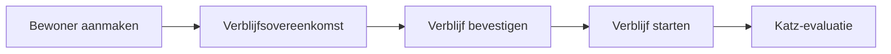

# Een bewoner beheren

Deze pagina beschrijft het volledige traject van een bewoner in Resthome: van de
**aanmaak** tot het **actieve verblijf**, via de **Katz-evaluatie** die de
RIZIV-facturatie bepaalt.

## Overzicht

!!! note "Twee data om niet te verwarren"
    - **Startdatum verblijf**: wanneer de facturatie van het verblijf (de kamer)
      begint.
    - **Opnamedatum**: wanneer de RIZIV-tegemoetkoming (het forfait) begint.

    Vaak zijn ze identiek, maar ze kunnen verschillen — Resthome beheert beide.

## 1. De bewoner aanmaken

1. Open de toepassing **MR/MRS → Bewoners**.
2. Klik op **Nieuw**.
3. Vul minstens in: **naam**, **geboortedatum**, **geslacht**, en het
   **rijksregisternummer (NISS)** indien gekend.
4. Selecteer de **mutualiteit** van de bewoner.
5. **Sla op**.

!!! warning "Het NISS is nodig voor eHealth"
    Zonder NISS kunnen de verzekerbaarheidscontrole (MDA) en de akkoorden
    (eAgreement) niet verstuurd worden. U kunt de bewoner zonder NISS aanmaken,
    maar vul het zo snel mogelijk aan.

## 2. Een verblijfsovereenkomst openen

Het **verblijf** koppelt de bewoner aan een kamer en start de facturatie.

1. Open op de fiche van de bewoner het tabblad **Verblijfsovereenkomst**.
2. Klik op **Regel toevoegen**.
3. Kies de **kamer** (enkel beschikbare kamers worden voorgesteld).
4. Geef het **verblijfstype** (ROB of RVT) en de **startdatum verblijf** op.
5. **Sla op**.

Het verblijf staat dan in de status **Concept**.

## 3. Bevestigen en het verblijf starten

Het verblijf doorloopt twee stappen:

1. **Bevestigen** — het verblijf wordt *Bevestigd* (de kamer is gereserveerd).
   De velden **opnamedatum en -uur** verschijnen: vul ze in.
2. **Start Stay (Starten)** — het verblijf wordt *Lopend* (de bewoner is
   effectief aanwezig).

!!! tip "Wat de start automatisch in gang zet"
    Bij de start doet Resthome:

    - de bewoner toevoegen aan de open **facturatieperiodes**;
    - voor een vooraf gefactureerde bewoner de **eerste verblijfsfactuur** van de
      opnamemaand aanmaken;
    - de **supplementenenveloppe** van de maand openen;
    - de **eAgreement voor opname** aanmaken (als het NISS aanwezig is).

## 4. De Katz-evaluatie invoeren

De **Katz**-categorie (O, A, B, C, Cd) bepaalt het **RIZIV-forfait**.

1. Open vanaf de fiche van de bewoner **Evaluatietools → Katz** (of de knop
   **Katz**).
2. Klik op **Nieuw** en scoor de 6 criteria (wassen, kleden, transfer, toilet,
   continentie, eten).
3. **Bevestig** en **Valideer** de evaluatie.

!!! note "Geen gevalideerde Katz?"
    Zolang er geen gevalideerde Katz bestaat, staat de bewoner standaard in
    categorie **O**, en verschijnt een herinnering « Katz te doen » op het dashboard.

## 5. De verzekerbaarheid controleren (MDA)

Controleer vóór het factureren of de bewoner wel verzekerd is:

1. Open de facturatieperiode van de maand, of de fiche van de bewoner.
2. Start een **MDA-controle** (verzekerbaarheid MyCareNet/WalCareNet).
3. Resthome werkt automatisch de **mutualiteit** en de **BIM**-status bij indien
   nodig.

## Bijzondere gevallen

- **Kamerwissel**: gebruik de speciale actie op het verblijf — de
  verblijfsfacturatie wordt gesplitst aan beide tarieven, zonder nieuwe opname.
- **Overdracht ROB ↔ RVT**: een assistent registreert de overdrachtsdatum en
  werkt het verblijfstype bij.
- **Afwezigheid / hospitalisatie**: zie de sectie
  [Facturatie](../facturation/index.md) — de afwezigheid past het forfait aan en
  kan een eHealth-melding genereren (Bijlage 11).
- **Einde verblijf / overlijden**: sluit het verblijf af; Resthome stopt de
  facturatie op de juiste datum en bereidt indien nodig de creditnota voor.

## Verder lezen

- [Facturatie](../facturation/index.md)
- [eHealth](../ehealth/index.md)
