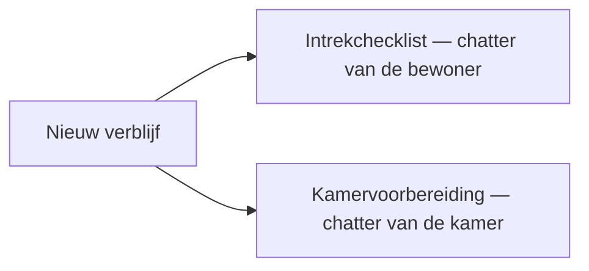

# De intrekprocedure

Bij elk **nieuw verblijf** — opname, kamerwissel, interne overdracht of heropname —
opent Resthome automatisch de **intrekprocedure** van de bewoner: een **checklist
met administratieve activiteiten** op de chatter van de bewoner, en de
**kamervoorbereiding** aan technische zijde. U hoeft niets manueel te starten: de
taken verschijnen in de **activiteiten** van de betrokken verantwoordelijken en op
de overeenkomstige chatters.

U kiest deze verantwoordelijken in **Instellingen ▸ Woonzorgcentrum ▸ Huisvesting**.

!!! info "Een optionele automatisering"
    De twee automatiseringen worden alleen geactiveerd als de overeenkomstige
    **verantwoordelijke** in de instellingen is ingesteld. Zolang een veld leeg is,
    blijft de automatisering stil — handig voor een data-import of een geleidelijke
    ingebruikname.

## Wat er wordt geactiveerd bij elk nieuw verblijf

Zodra een **verblijf** wordt aangemaakt (via de [opnamewizard](admissions.md), de
conversie van een CRM-opportuniteit, of een
[kamerwissel / overdracht](changement-chambre.md)), plant Resthome tegelijk de
**twee luiken** van de procedure. De vervaldatum van alle activiteiten is de
**begindatum van het verblijf**.

| Gebeurtenis | Checklist bewoner | Kamervoorbereiding |
|---|---|---|
| **Eerste opname** | 6 taken | Nieuwe kamer voorbereiden |
| **Kamerwissel** | 6 taken | Nieuwe kamer voorbereiden **en** oude weer in orde brengen |
| **Interne overdracht** (ROB ↔ RVT) | 6 taken | Nieuwe kamer voorbereiden **en** oude weer in orde brengen |
| **Heropname** | 6 taken | Kamer voorbereiden (geen herstel — de oude was al vrijgemaakt) |

!!! note "Zonder duplicaten"
    De activiteiten zijn **idempotent**: als u het verblijf opnieuw opslaat, stapelt
    Resthome geen identieke, reeds openstaande activiteit. Een **geannuleerd**
    verblijf, of een verblijf zonder kamer of bewoner, genereert geen enkele taak.

## De intrekchecklist (zes taken)

De checklist wordt gepland op de **chatter van de bewoner** (activiteit van het type
**Intrekprocedure**), toegewezen aan de **Verantwoordelijke intrekprocedure**. Ze
omvat zes taken:

| Taak | Waarvoor ze dient |
|---|---|
| **De overeenkomst ondertekenen met de vertegenwoordiger van de bewoner** | De opnameovereenkomst laten ondertekenen met de referentiepersoon |
| **Plaatsbeschrijving bij in- / uittrede** | De tegensprekelijke vaststelling van de kamer opmaken (zie [De plaatsbeschrijving](etat-des-lieux.md)) |
| **De privé-inventaris van de bewoner bijwerken** | De meegebrachte privémeubelen voor de nieuwe kamer opnemen (zie [Het meubilair](mobilier.md)) |
| **Het medicatiekastje bijwerken** | Het medicatiekastje van de kamer verplaatsen / herlabelen |
| **De wasserij bijwerken** | De wasserijdienst van de bewoner bijwerken |
| **De nieuwe / oude kamer ontsmetten** | De aankomstkamer ontsmetten (en de oude, bij een kamerwissel) |

!!! tip "Vink af wat van toepassing is"
    De lijst is **dezelfde** voor een eerste opname en voor een kamerwissel. De
    verantwoordelijke **markeert als gedaan** of **verwijdert** de stappen zonder
    voorwerp — er is bijvoorbeeld geen oude kamer te ontsmetten bij een eerste
    intrede.

<!-- capture toe te voegen : chatter van een bewoner met de 6 activiteiten « Intrekprocedure » gepland op de begindatum van het verblijf -->

## De kamervoorbereiding

Tegelijk plant Resthome de **kamervoorbereiding** op de **chatter van de kamer**
(activiteit van het type **Kamervoorbereiding**), toegewezen aan de **Technisch
verantwoordelijke kamers**:

- **Kamer voorbereiden — aankomst van …** : altijd gepland op de **aankomstkamer**,
  op de begindatum van het verblijf.
- **Kamer weer in orde brengen — vertrek van …** : gepland op de **verlaten kamer**,
  alleen bij een **kamerwissel** of een **interne overdracht** (wanneer de bewoner
  effectief een bezette kamer vrijmaakt).

!!! note "Geen herstel bij intrede of heropname"
    De activiteit « Kamer weer in orde brengen » wordt **niet** aangemaakt voor een
    eerste opname (geen vorige kamer) noch voor een heropname (de oude kamer werd al
    vrijgemaakt en gereinigd bij het vorige vertrek).

## De verantwoordelijken instellen

De twee automatiseringen steunen op twee configuratievelden, eigen aan uw
instelling. Ga naar **Instellingen ▸ Woonzorgcentrum ▸ Huisvesting**:

1. **Verantwoordelijke intrekprocedure** — de gebruiker die de checklist van de
   bewoner ontvangt (de 6 taken hierboven). Leeg laten **schakelt** de checklist
   **uit**.
2. **Technisch verantwoordelijke kamers** — de gebruiker die de activiteiten voor
   **voorbereiding** en **herstel** van kamers ontvangt. Leeg laten **schakelt**
   deze activiteiten **uit**.

!!! warning "Zonder verantwoordelijke, geen activiteiten"
    Als een veld leeg blijft, maakt de overeenkomstige automatisering **geen** enkele
    activiteit aan. Wijs minstens de **Verantwoordelijke intrekprocedure** aan om bij
    elk nieuw verblijf van de checklist te genieten.

<!-- capture toe te voegen : sectie Huisvesting van de instellingen met de velden Technisch verantwoordelijke kamers en Verantwoordelijke intrekprocedure -->

## Kernpunten om te onthouden

- De intrekprocedure wordt **automatisch** geactiveerd bij het openen van elk nieuw
  verblijf: opname, kamerwissel, interne overdracht, heropname.
- Ze bestaat uit twee luiken: een **checklist van 6 taken** op de chatter van de
  bewoner en de **kamervoorbereiding** op de chatter van de kamer.
- Alle activiteiten hebben als **vervaldatum de begindatum van het verblijf** en
  worden toegewezen aan de geconfigureerde **verantwoordelijken**.
- De zes taken: **overeenkomst**, **plaatsbeschrijving**, **privé-inventaris**,
  **medicatiekastje**, **wasserij**, **ontsmetting** — de verantwoordelijke sluit af
  of verwijdert wat zonder voorwerp is.
- U wijst de verantwoordelijken aan in **Instellingen ▸ Woonzorgcentrum ▸
  Huisvesting**; een leeg veld **schakelt** de overeenkomstige automatisering **uit**.

## Verder

- [Een bewoner beheren](gerer-un-resident.md)
- [Kamerwissel en overdracht](changement-chambre.md)
- [De plaatsbeschrijving (intrede en uittrede)](etat-des-lieux.md)
- [Algemene instellingen (bewoners, kamers)](../configuration/reglages-generaux.md)
